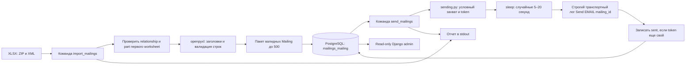
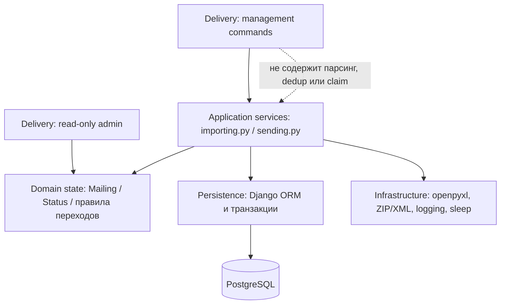
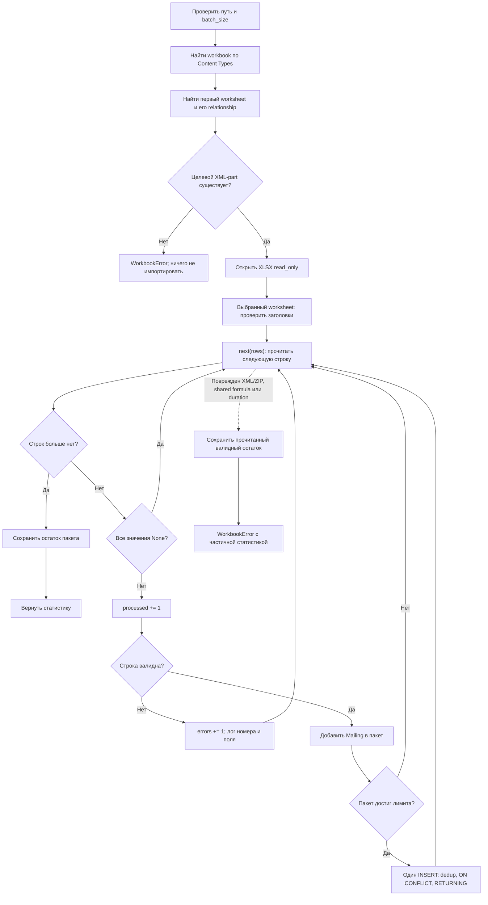

# Как защитить задачу 2: импорт рассылок из XLSX

Этот конспект описывает именно текущую реализацию в `task2`, а не идеальную систему рассылок. Его удобно читать последовательно, а перед защитой — повторить разделы про сбои, ограничения и вопросы. Описание обновлено после исправлений импорта и отправителя; исторические проблемы отдельно отмечены как исправленные.

## 1. Ответ за одну минуту

> Я разделил импорт и отправку на две Django management commands. Импорт проверяет, что XML-часть первого объявленного worksheet существует, затем читает его через openpyxl, валидирует строки и пакетами сохраняет письма в PostgreSQL. `external_id` уникален в БД: повторный импорт сохраняет первое валидное содержимое и не создаёт повторное задание. Отправитель назначает владельца условным UPDATE, ждёт 5–20 секунд и пишет транспортное событие строгим StreamHandler: отказ записи считается ошибкой отправки. Результат записывает только текущий владелец. PostgreSQL CHECK дополнительно контролирует форму состояния. Русская Django admin показывает очередь персоналу, но запрещает добавление, изменение и удаление в обход service-слоя. После аварии задание можно забрать заново через пять минут. Решение работает без брокера и почтового сервера, но не обещает единственную отправку при аварии между внешним действием и записью результата в БД.

Главные оговорки, которые нужно назвать самому:

- Это имитация почты: лог вместо SMTP или API почтового провайдера.
- Это две команды, а не постоянно работающий фоновый сервис.
- Админка — только авторизованный экран наблюдения, а не ещё один способ менять очередь.
- PostgreSQL разрешает конкурентные вставки; точность счетчиков обеспечивают `ON CONFLICT` и `RETURNING`.
- Импорт ограничивает размер собственного пакета, но не гарантирует постоянную память всей библиотеки openpyxl.
- `max_id` ограничивает диапазон текущего запуска отправителя; это не настоящий снимок состояния всей очереди в транзакции.
- Доставка имеет риск повторного внешнего действия после аварии. Строгое exactly-once не реализовано.

## 2. Что требовалось и что получилось

| Требование | Реализация | Важная граница |
|---|---|---|
| Django-проект, Python 3.10+ | Проект `config`, приложение `mailings`, Django 5.2.17 | 48 тестов прошли на Python 3.10 и 3.12; подготовлена CI-матрица |
| Административный интерфейс | Русская read-only Django admin | Auth/session/CSRF; поиск и фильтры; CRUD/actions запрещены |
| Импорт XLSX через management command | `python manage.py import_mailings path.xlsx` | Читается первый объявленный worksheet; его relationship и XML-part проверяются до openpyxl |
| Первая строка содержит заголовки | Поиск пяти обязательных имен | Регистр значим; лишние колонки разрешены |
| Большое количество строк | `read_only` + пакеты до 500 валидных строк | Shared strings и метаданные книги могут дополнительно занимать память |
| Дедупликация по `external_id` | Очистка пробелов, проверка существования, UNIQUE в БД | Область уникальности — весь проект, без разделения по внешним системам или клиентам |
| Отправка с задержкой | Отдельная команда, `sleep(randint(5, 20))`, затем лог | Письма фактически не отправляются |
| Результат обработки | Счетчики в stdout; предупреждения/события в logging | DB-сбой дополняет отчет незавершенными строками или неподтвержденным результатом |
| SQLite или PostgreSQL | PostgreSQL | Compose использует PostgreSQL 18.6; локальные тесты прошли на поддерживаемом 16.14 |
| Продуманный код, документация, тесты | Раздельные модули, README, пример XLSX, автоматизированные тесты, GitHub Actions | CI запускается при push/PR; многопроцессный нагрузочный сценарий не сохранен |
| Публичный GitHub, ветка main | Проект подготовлен для ветки `main` | Visibility и default branch проверяются в настройках GitHub |

## 3. Слова, которыми обычно проверяют понимание

| Термин | Простое объяснение | Где используется |
|---|---|---|
| Management command | Команда Django для работы из терминала, без HTTP-запроса | Импорт и отправка |
| ORM | Python API для SQL: `Mailing.objects.filter(...)` превращается в запрос к БД | Чтение/вставка/обновление писем |
| Модель | Python-описание полей записи | `Mailing` |
| Миграция схемы | Версионированная инструкция, создающая или меняющая таблицы | `0001_initial.py` и `0002_...` |
| PK / primary key | Внутренний уникальный номер строки | Поле `id`, псевдоним `pk` в ORM |
| Внешний ID | Идентификатор, который прислал источник данных | `external_id` и `user_id` |
| UNIQUE | Правило БД: два одинаковых значения запрещены | `external_id` |
| Транзакция | Несколько действий с БД, которые фиксируются вместе или откатываются вместе | Сохранение одного пакета |
| Commit | Зафиксировать изменения транзакции | После вставки пакета |
| Rollback | Отменить незавершенные изменения транзакции | При ошибке вставки |
| Batch / пакет | Небольшая группа строк вместо всего файла | До 500 валидных писем |
| Идемпотентность | Повтор действия не добавляет нежелательный дополнительный результат | Повтор импорта одного `external_id` |
| Side effect | Действие вне расчета в Python, например письмо или запись события | Здесь лог отправки |
| Race condition / гонка | Результат зависит от чередования действий нескольких процессов | Проверка ID перед вставкой; выбор задания перед захватом |
| CAS / compare-and-set | Изменить данные только если условие все еще истинно | Условный UPDATE задания |
| Lease | Ограниченный срок владения заданием | Пять минут после `claimed_at` |
| Claim token | Метка конкретного владельца конкретной попытки | UUID в `claim_token` |
| Worker / работник | Процесс, который берет и выполняет задания | Каждый запуск `send_mailings` |
| Retry | Повторная попытка | Явный `--retry-failed`; повторный запуск после истечения lease |
| At-least-once | Подход допускает повтор внешнего действия, чтобы не терять незавершенное задание | Аварийное восстановление отправки; успешный результат не гарантирован без последующих запусков и успешного транспорта |
| Exactly-once | Внешний результат появился ровно один раз | В текущем решении не обеспечивается |
| Backpressure | Замедление приема/обработки, когда потребитель не успевает | Сейчас отдельного механизма нет |

## 4. Архитектура и файлы

Схема 1: общая архитектура.



| Файл | За что отвечает | Почему выделен отдельно |
|---|---|---|
| [manage.py](./manage.py) | Выбирает `config.settings`, передает argv Django | Стандартная точка входа проекта |
| [config/settings.py](./config/settings.py) | PostgreSQL через окружение, logging, часовой пояс | Настройки инфраструктуры |
| [config/urls.py](./config/urls.py) | Маршрут `/admin/` | Единственный HTTP-интерфейс проекта |
| [mailings/apps.py](./mailings/apps.py) | AppConfig и русское имя приложения | Заголовок раздела админки |
| [mailings/admin.py](./mailings/admin.py) | Read-only список, поиск, фильтры и карточка письма | Наблюдение без обхода workflow |
| [mailings/models.py](./mailings/models.py) | Структура, русские имена, статусы и CHECK | Данные письма, состояние и DB-инварианты |
| [mailings/migrations/0001_initial.py](./mailings/migrations/0001_initial.py) | Создание таблицы и индексов | Схема БД воспроизводится через Django |
| [mailings/migrations/0002_alter_mailing_options_alter_mailing_attempts_and_more.py](./mailings/migrations/0002_alter_mailing_options_alter_mailing_attempts_and_more.py) | Локализация модели и два CHECK constraints | Версионированное усиление схемы |
| [mailings/importing.py](./mailings/importing.py) | Разбор XLSX, валидация, пакетное сохранение, статистика | Логику можно вызвать и тестировать без CLI |
| [mailings/sending.py](./mailings/sending.py) | Захват, имитация транспорта, переходы статусов | Управление заданиями отдельно от парсинга файла |
| [команда импорта](./mailings/management/commands/import_mailings.py) | Аргументы, запуск функции, отчет, `CommandError` | Обработчик команды остается тонким |
| [команда отправки](./mailings/management/commands/send_mailings.py) | `--limit`, `--retry-failed`, отчет | То же разделение CLI и логики |
| [mailings/tests.py](./mailings/tests.py) | Временные XLSX, тестовая БД, искусственные сбои | Проверяет поведение и ограничения |
| [README.md](./README.md) | Запуск, контракт формата, ограничения | Документация для запуска проекта |
| [examples/mailings.xlsx](./examples/mailings.xlsx) | Два демонстрационных письма | Можно быстро показать повторный импорт |
| [compose.yaml](./compose.yaml) | Локальный PostgreSQL 18.6, healthcheck и постоянный volume | Одинаковый запуск базы без ручной установки |
| [requirements.in](./requirements.in) / [requirements.txt](./requirements.txt) | Диапазоны прямых и точные версии всех runtime-зависимостей | Воспроизводимая установка на Python 3.10+ |
| [.github/workflows/ci.yml](./.github/workflows/ci.yml) | Python 3.10/3.12, проверки Django, тесты и Ruff | Запускается в GitHub при push и pull request |

Здесь нет Repository, Factory, интерфейса транспорта с единственной реализацией, Celery или REST API. Эти слои не нужны для текущих двух команд. Это не запрещает добавить их позже при конкретной потребности, но сейчас они только увеличили бы объем кода и количество инфраструктуры.

### 4.1. Слоистая архитектура без декоративных слоев

Текущая структура уже слоистая, хотя каталог буквально не называется `services`:



| Слой | Что делает сейчас | Чего в нем нет |
|---|---|---|
| Delivery / CLI | Парсит аргументы, вызывает use case, печатает отчет, переводит ожидаемую ошибку в `CommandError` | SQL, чтения ячеек, retry и переходов статуса |
| Delivery / Admin | Показывает локализованный список и карточку авторизованному staff | Add/change/delete/actions и бизнес-переходы |
| Application service | Выполняет весь сценарий импорта или отправки, задает транзакционные границы и возвращает типизированную статистику | Зависимости от stdout и устройства Django command |
| Domain state | Модель хранит данные, статусы, UNIQUE и CHECK constraints | Оркестрация XLSX и внешнего side effect в `save()` или signals |
| Infrastructure | Django ORM/psycopg, PostgreSQL, openpyxl, безопасный XML-parser и logging реализуют I/O | Отдельный адаптер для каждого вызова, пока существует только одна реализация |

Направление вызовов одностороннее: команда импортирует service, service импортирует модель,
модель не знает о командах. Поэтому те же функции можно вызвать из теста, будущего worker или
API. Настройки собирают инфраструктуру, но бизнес-поток не читает аргументы командной строки.

Транзакционная граница импорта — один INSERT текущего пакета: в autocommit PostgreSQL считает
statement отдельной атомарной транзакцией. Чтение XLSX, валидация и задержка транспорта
выполняются вне неё. Это часть архитектуры: слой — не только каталог, но и явная граница
ответственности, ошибок и commit.

Two Scoops of Django полезен здесь как набор принципов, а не как требование копировать дерево
каталогов: держать входные обработчики тонкими, не прятать значимую логику в них и использовать
понятные Django-модули. Официальный репозиторий книги относится к Django 3.x, поэтому API и
security-настройки для Django 5.2 нужно сверять с текущей документацией фреймворка:
[репозиторий Two Scoops of Django 3.x](https://github.com/feldroy/two-scoops-of-django-3.x).

Для сравнения, Django Styleguide называет services местом операций записи и orchestration,
selectors — местом переиспользуемых запросов, причем service может быть функцией или целым
модулем. Он сам рекомендует выбирать только подходящие проекту правила:
[HackSoft Django Styleguide](https://github.com/HackSoftware/Django-Styleguide).

Здесь отдельный `selectors.py` не нужен: запрос выбора следующего задания используется только
в одном use case и тесно связан с условным UPDATE. Repository поверх Django ORM тоже не даст
новой гарантии. Эти границы стоит выделить, когда появятся повторное чтение очереди из разных
входов, несколько моделей в одном доменном сценарии, второй транспорт или необходимость
заменять инфраструктуру независимо.

Если проект вырастет, минимальная следующая структура может выглядеть так:

```text
mailings/
├── management/commands/       # только вход CLI
├── services/
│   ├── importing.py           # use case импорта
│   └── sending.py             # use case отправки
├── selectors.py               # только реально переиспользуемые чтения
└── transports.py              # когда появится настоящий провайдер или несколько реализаций
```

Переносить текущие два модуля ради этой картинки преждевременно: он изменит импорты и тесты,
но не разделит ни одной смешанной ответственности.

## 5. Одна таблица: 13 полей Mailing

Таблица Django называется `mailings_mailing`: имя приложения плюс имя модели. Одна запись одновременно хранит содержимое письма и состояние его обработки.

| Поле | Тип Django | Значение при создании/пустое значение | Что означает |
|---|---|---|---|
| `id` | `BigAutoField`, PK | Назначает БД | Внутренний ID; используется в логах, выборе очереди и границе запуска |
| `external_id` | `CharField(255)`, UNIQUE | Обязательное | Ключ дедупликации исходной записи |
| `user_id` | `PositiveBigIntegerField` | Обязательное | ID пользователя во внешней системе; не FK на Django User |
| `email` | `EmailField(254)` | Обязательное | Получатель; не пишется в лог |
| `subject` | `CharField(255)` | Обязательное | Тема письма |
| `message` | `TextField` | Обязательное | Текст письма; импорт ограничивает 32767 символами |
| `status` | `CharField(10)`, индекс, choices | `pending` | `pending`, `processing`, `sent`, `failed` |
| `created_at` | `DateTimeField(auto_now_add=True)` | Ставит Django | Время создания задания |
| `sent_at` | `DateTimeField(null=True)` | `NULL` | Время фиксации успешной отправки, а не подтверждение прочтения письма |
| `claimed_at` | `DateTimeField(null=True)` | `NULL` | Когда началась текущая попытка владения |
| `claim_token` | `UUIDField(null=True)` | `NULL` | Какому владельцу разрешено завершить задание |
| `attempts` | `PositiveIntegerField` | `0` | Число успешных захватов, включая повторные после аварии |
| `last_error` | `CharField(128, blank=True)` | Пустая строка | Только имя класса последней ошибки транспорта |

`id` и `external_id` нельзя путать. Например, источник прислал `external_id="campaign-row-183"`, а локальная БД назначила `id=7`. Дедупликация работает по `campaign-row-183`; работник и лог могут использовать безопасный внутренний номер 7.

`user_id` не отвечает на вопрос, есть ли такой получатель среди Django auth users. Стандартная
модель User используется только для входа персонала в admin; `Mailing.user_id` остаётся ID
внешней системы и не имеет FK. Для продукта нужно определить источник получателей, область
доступа и бизнес-правило соответствия `user_id` и `email`.

### 5.1. Что действительно защищает база

Сгенерированный для PostgreSQL SQL по смыслу содержит:

```sql
"external_id" varchar(255) NOT NULL UNIQUE,
"user_id" bigint NOT NULL CHECK ("user_id" >= 0),
"status" varchar(10) NOT NULL,
"attempts" integer NOT NULL CHECK ("attempts" >= 0),
CONSTRAINT "mailing_user_id_gt_0" CHECK ("user_id" > 0),
CONSTRAINT "mailing_status_fields_consistent" CHECK (...)
```

И отдельно индекс на `status`. UNIQUE обычно сопровождается индексом, позволяющим искать внешний ID без полного перебора таблицы. Индекс `status` помогает отбирать задания нужного состояния, но не означает, что сложный запрос очереди при любом объеме оптимален: это проверяется планом запроса и замером.

Первый дополнительный CHECK запрещает нулевой `user_id`. Второй разрешает только такие формы:

- `pending` или `failed`: token, claimed_at и sent_at равны NULL;
- `processing`: token и claimed_at заполнены, sent_at равен NULL;
- `sent`: sent_at заполнен, token и claimed_at равны NULL.

Из-за перечисления статусов в этом CHECK произвольное значение status тоже отклоняется.
Однако схема не проверяет синтаксис email и непустой текст сообщения, а ORM `.create()` и
`.save()` сами не вызывают `full_clean()`. Поэтому валидация на границе XLSX остаётся
обязательной. Read-only admin не создаёт второй путь записи; будущий API должен переиспользовать
валидацию и service-переходы.

### 5.2. Что делает админка

Django автоматически находит `mailings/admin.py` при загрузке `django.contrib.admin`.
`@admin.register(Mailing)` связывает модель с `MailingAdmin`. `MailingsConfig.verbose_name`,
`Meta.verbose_name_plural`, verbose_name полей и русские подписи `TextChoices` отвечают за
тексты интерфейса; значения в БД остаются стабильными английскими кодами.

Changelist показывает основные идентификаторы, email, статус, attempts и даты. Есть фильтры
по status/датам, поиск по внешнему ID, user ID, email и subject, date hierarchy и пагинация
по 100 строк. `show_full_result_count=False` не выполняет дополнительный полный COUNT ради
надписи «всего N» при отфильтрованной большой таблице.

Все поля readonly, actions отключены, add/change/delete permissions возвращают False.
Даже суперпользователь не меняет очередь через форму: иначе он мог бы удалить dedup-key,
поставить `sent` без транспортного действия или украсть token. Админка использует стандартные
auth, session, CSRF, messages, SecurityMiddleware и X-Frame-Options middleware.

## 6. Путь запуска команды

При запуске:

```sh
python manage.py import_mailings examples/mailings.xlsx --batch-size 500
```

происходит следующее:

1. Python выполняет `manage.py`.
2. В `DJANGO_SETTINGS_MODULE` выбирается `config.settings`, если значение не было задано снаружи.
3. Django загружает настройки и приложение `mailings`.
4. Django находит `mailings/management/commands/import_mailings.py`.
5. Парсер преобразует позиционный путь в `Path`, размер пакета — в `int`.
6. `handle()` проверяет параметры и вызывает `import_mailings(path, batch_size)`.
7. Функция возвращает `ImportStats`, бросает `WorkbookError` с частичной статистикой
   либо `ImportDatabaseError`, если результат DB-операции пакета не подтвержден.
8. Команда всегда печатает безопасный отчет для этих ожидаемых исходов. При ошибочных
   строках, ошибке книги или БД она бросает `CommandError`, чтобы CLI завершился неуспешно.
   Для DB-сбоя отчет содержит `незавершённых строк`, но не текст низкоуровневого исключения.

Команда не содержит парсинг Excel и бизнес-логику. Это помогает тестировать функцию напрямую и позднее вызывать ее из другого входа, не притворяясь пользовательским запуском терминала.

## 7. Как читается XLSX

XLSX — ZIP-архив с XML-файлами. Основной разбор делает openpyxl. Перед ним есть одна
узкая проверка пакета через стандартный `zipfile` и безопасный `defusedxml`, потому что openpyxl 3.1.5
может молча пропустить объявленный лист, если его XML-part отсутствует, и тогда
`workbook.worksheets[0]` уже укажет на следующий лист.

Схема 2: импорт.



Настройки загрузки:

| Параметр | Зачем установлен |
|---|---|
| `read_only=True` | Не строить обычную редактируемую книгу целиком; читать строки последовательно |
| `data_only=False` | Видеть саму формулу и отклонять ее, а не принимать сохраненный ранее результат вычисления |
| `keep_links=False` | Не сохранять информацию о внешних ссылках, которая для импорта не нужна |

Проверка находит workbook через `[Content_Types].xml`, затем его файл relationships,
идет по объявленным sheets и выбирает первый relationship типа `worksheet`. Target
разрешается относительно каталога workbook; абсолютный target от корня пакета тоже
поддерживается. Поэтому код не зависит от имени `xl/worksheets/sheet1.xml`. Отсутствующий,
внешний или пустой target завершает импорт ошибкой вместо перехода к следующему листу.

Три служебные XML-части (`[Content_Types].xml`, workbook и workbook relationships)
разбираются `defusedxml` с запретом DTD и XML entities. Каждая из них ограничена 10 MiB:
лимит проверяется по `ZipInfo.file_size` до чтения целой части. Он закрывает узкий риск
служебных метаданных и не мешает потоково читать большой worksheet. Это не полный лимит
XLSX: размер архива, распакованных worksheet/shared strings, число строк и колонок отдельно
не ограничены.

После проверки обрабатывается `workbook.worksheets[0]`: теперь это тот worksheet, наличие
которого уже подтверждено. `reset_dimensions()` позволяет не полагаться на неверно
записанную границу используемых ячеек. Генератор строк, книга и исходный файл закрываются
даже при ошибке. Для read-only книги явное закрытие важно; режим чтения и проблема размеров
листа описаны в [официальной документации openpyxl](https://openpyxl.readthedocs.io/en/stable/optimized.html).

### 7.1. «Потоково» не означает «вся память строго O(1)»

В приложении нет `list(sheet.rows)` на весь файл и нет накопления всех писем. В основном пакете не больше `batch_size` валидных `Mailing`, максимум 500. При сохранении дополнительно создаются небольшие словарь уникальных записей, список новых объектов и множество существующих ID.

Однако сама библиотека может хранить shared strings — общую таблицу текстов XLSX — и метаданные книги. Отдельная строка также может иметь много лишних ячеек. Поэтому правильная формулировка: **ограничено накопление строк самим приложением; общий постоянный расход памяти не обещан**.

Если нужен гарантированный общий лимит для недоверенных огромных файлов, понадобятся ограничения размера архива/распаковки/листов/колонок и измерения памяти на реальных данных. Иногда разумнее принять CSV с потоковым парсером, но это уже изменение входного контракта.

## 8. Заголовки и строки: точный контракт

### 8.1. Заголовки

Обязательные имена: `external_id`, `user_id`, `email`, `subject`, `message`.

- Порядок произвольный: создается словарь «название → номер ячейки».
- Пробелы по краям заголовков убираются.
- `Email` и `email` различаются.
- Лишние колонки игнорируются при разборе письма.
- Повтор обязательного имени — ошибка всей книги.
- Отсутствие хотя бы одного обязательного имени — ошибка всей книги.
- Пустая первая строка не заменяется поиском заголовков где-то ниже.

Пример:

| message | extra | email | user_id | subject | external_id |
|---|---|---|---|---|---|
| Текст | Произвольное | user@example.com | 12 | Тема | row-12 |

Этот файл допустим. Импортер не требует фиксированного порядка и не вставляет `extra` в модель.

### 8.2. Пустота строки

Строка пропускается без увеличения `processed`, только если **все** ячейки, выданные openpyxl, имеют `value is None`.

Строка из пробелов не считается пустой: она проверяется и становится ошибочной. Если заполнена только дополнительная колонка, а обязательные пустые, строка тоже не пустая и становится ошибочной. Это полезная тонкость для ответа на вопрос «почему у меня пустая строка попала в ошибки?».

### 8.3. Поля

| Поле | Допустимо | Отклоняется | Нормализация |
|---|---|---|---|
| `external_id` | Непустой текст длиной после strip 1..255; целое число с `abs(value) < 10**15` | bool, float, дата, слишком длинный текст, NUL, незащищенное большое числовое значение | Крайние пробелы убираются; допустимое число превращается в строку |
| `user_id` | Целое 1..2^63−1; большие значения в виде текста из ASCII-цифр, до 19 символов после strip | bool, дробь, 0, отрицательное, overflow, не-ASCII цифры, текст с плюс/минусом | Текст превращается в int; ведущие нули теряются, потому что это числовой ID |
| `email` | Непустой текст, длина исходной строки до 254, проверка Django `validate_email` | Неверная форма адреса, числа вместо текста, CR/LF, NUL | Крайние пробелы убираются после проверки длины |
| `subject` | Непустой текст до 255 | Число, только пробелы, CR/LF, NUL | Крайние пробелы сохраняются |
| `message` | Непустой текст до 32767 | Число, только пробелы, NUL, лишняя длина | Крайние пробелы и переводы строк сохраняются |

Формулы (`data_type="f"`) и ошибки Excel (`data_type="e"`) в обязательных колонках отклоняются до проверки конкретного поля. Формулы не вычисляются. Формула в игнорируемой дополнительной колонке сама по себе не используется в письме.

`type(value) is int` намеренно строже `isinstance(value, int)`: в Python bool — подкласс int. `True` не должен становиться идентификатором 1. Дробное значение также нельзя молча округлять: это может отправить письмо неправильному человеку.

Excel может потерять точность длинного числа еще до Python. Поэтому ограничение 15 цифрами для числовых ячеек — защита от уверенного принятия уже поврежденного ID. Числа длиннее нужно записывать текстом: текстовый формат нужно задать **до ввода** длинного ID. Позднее переключение формата не восстановит уже округленные цифры. Числовая точность 15 цифр и предел 32767 символов ячейки указаны в [официальных ограничениях Excel](https://support.microsoft.com/en-us/excel/excel-specifications-and-limits).

Несколько дополнительных нюансов:

- Числовой `external_id` может быть отрицательным: это непрозрачный ключ, в отличие от положительного `user_id`.
- Текстовые `"00042"` и `"42"` — разные external_id. Числовой 42 становится `"42"`.
- `external_id=" row-1 "` и `"row-1"` считаются одним ключом после strip.
- Проверка email проверяет допустимую форму, а не существование почтового ящика.
- Лимит текста сообщения — контракт импортера, а не объявленный DB CHECK на TextField.
- Нет проверки бизнес-связи `user_id ↔ email`, согласия на рассылку или прав импортирующего оператора.

## 9. Дедупликация и пакетное сохранение

`parse_row()` возвращает объект `Mailing`, который пока существует только в памяти. Создание `Mailing(...)` не вставляет строку в БД. После накопления пакета вызывается `save_batch()`.

Шаги одного пакета:

1. Строится словарь `unique` по external_id.
2. `setdefault` сохраняет первый объект при повторном ключе; последующий объект его не заменяет.
3. Для всех уникальных строк строится один `INSERT` с несколькими `VALUES`.
4. `ON CONFLICT (external_id) DO NOTHING` оставляет существующие записи без изменений.
5. `RETURNING 1` возвращает по строке только для реально выполненных вставок.
6. `created` равен числу строк результата, `skipped = len(batch) - created`.
7. Только после успешного statement пакет очищается.

Имена таблицы и колонок создаются через `psycopg.sql.Identifier`, а все значения передаются bound parameters. Пользовательский текст не конкатенируется с SQL. На пакет приходится один INSERT вместо SELECT и построчных `.create()`; лимит 500 дает не более 6000 параметров.

Raw SQL здесь локализован в `save_batch()` ради PostgreSQL-возможности, которой ORM-вариант `bulk_create(ignore_conflicts=True)` не дает: точного числа вставленных объектов при конфликтах. Валидация остается до вставки, потому что ни raw INSERT, ни обычный ORM `.create()` не вызывают `full_clean()` автоматически. Семантика `ON CONFLICT` и `RETURNING` описана в [PostgreSQL INSERT](https://www.postgresql.org/docs/current/sql-insert.html).

### 9.1. Почему «первая валидная запись»

| Строка | external_id | Содержимое | Результат |
|---|---|---|---|
| 2 | A | Ошибочный email | Ошибка; ключ не занимает |
| 3 | A | Валидное письмо «Первое» | Создается |
| 4 | A | Валидное письмо «Измененное» | Пропускается |
| 5 | B | Валидное письмо | Создается |

Результат: processed=4, created=2, skipped=1, errors=1. Содержимое A — «Первое».

Дубликаты сначала проходят валидацию. Если уже существующий ID приходит с неверным email, такая строка считается ошибочной, а не пропущенной. Текущий контракт определяет `skipped` как повтор валидной строки.

Если запись уже есть в БД, импорт не обновляет email/subject/message/status. Это предотвращает повторное включение уже отправленного письма в очередь. Исправление содержимого означает новую исходную запись с новым external_id либо отдельную явно спроектированную операцию редактирования.

### 9.2. Почему одного предварительного UNIQUE-check недостаточно для счетчиков

Представим два импорта A и B с алгоритмом SELECT → INSERT:

1. A проверяет ID X: его нет.
2. B проверяет ID X: его нет.
3. A вставляет X.
4. B пытается вставить X и получает UNIQUE violation.

UNIQUE спасает таблицу от дубля, но предварительный `len(new)` уже неверен для B. Текущий код вообще не делает такой SELECT. Оба процесса посылают `INSERT ... ON CONFLICT DO NOTHING RETURNING 1`. PostgreSQL атомарно разрешает конфликт на UNIQUE-индексе: победитель получает одну строку из RETURNING, проигравший — ноль. Поэтому counters основаны на факте, а не на устаревающем предположении.

Реальный `TransactionTestCase` открывает два отдельных PostgreSQL-соединения, синхронизирует их перед `save_batch()` и проверяет пары `(created, skipped) = (1, 0)` и `(0, 1)`. В таблице остается ровно одна строка. Блокировка всей таблицы, уровень SERIALIZABLE и retry-loop для нормального конфликта не требуются.

### 9.3. Почему не одна транзакция на весь файл

| Решение | Плюсы | Минусы |
|---|---|---|
| Весь файл в одной транзакции | Либо весь импорт, либо ничего | Долгое удержание права записи, большая незавершенная операция, откат всей работы из-за поздней ошибки |
| Транзакция на каждый пакет | Короткие записи, прогресс сохраняется, повтор файла безопасен | Частичный импорт является частью контракта; нельзя обещать «весь файл атомарно» |

В проекте выбран пакетный вариант. Если продукт требует утверждения кампании целиком до отправки, можно отдельно импортировать во временную/staging-область и публиковать кампанию после полного успешного контроля. Сейчас такой сущности нет.

## 10. Счетчики и ошибки импорта

| Счетчик | Что считает | Чего не считает |
|---|---|---|
| `processed` | Прочитанные непустые строки после заголовка | Заголовок; полностью None-строки; строки, которые parser книги не смог выдать |
| `created` | Реально сохраненные новые Mailing | Повторы и невалидные строки |
| `skipped` | Валидные повторные строки | Невалидные повторы |
| `errors` | Ошибки проверки конкретных прочитанных строк | Ошибку структуры всей книги или сбой БД как «еще одну плохую строку» |

На нормальном завершении и при обработанной ошибке чтения после сохранения остатка выполняется:

```text
processed = created + skipped + errors
```

При жестком завершении процесса итогового отчета может вообще не быть. При ожидаемом
`DatabaseError` уже подтвержденные пакеты остаются, а текущий пакет не классифицируется:
если соединение оборвалось около commit, приложение не вправе утверждать ни commit, ни rollback
без повторного чтения БД. `ImportDatabaseError` переносит накопленные счетчики в management
command, поэтому stdout дополняется величиной:

```text
незавершённых строк = processed - created - skipped - errors
```

Это прочитанные строки, для которых приложение не подтвердило created/skipped из-за DB-сбоя.
Затем команда поднимает безопасный `CommandError`. Она не повторяет `save_batch()`: слепой
retry мог бы повторить неясный результат записи. Перед повтором оператор проверяет БД;
повторный импорт остается безопасным по `external_id` и UNIQUE.

`RowError` означает «эта строка не соответствует контракту». Импорт предупреждает, увеличивает errors и идет дальше. Парсер останавливается на первом найденном нарушении: errors считает строки с ошибками, а не все неправильные поля внутри них. `HeaderError` означает «непонятно, как разбирать все строки» и превращается в ошибку книги. `WorkbookError` несет человеческое сообщение и частичные `ImportStats`; service-слой сохраняет техническую причину через `raise ... from exc`. Management command выводит безопасное сообщение и поднимает ожидаемый `CommandError` через `from None`, поэтому даже флаг `--traceback` не раскрывает исходный XML или DB payload.

Низкоуровневые `FILE_ERRORS` перехватываются только вокруг проверки/загрузки книги и
непосредственного `next(rows)`, включая чтение заголовка. Среди них явно есть
`TranslatorError` от поврежденной shared formula и `OverflowError` от некорректной
Excel duration. Перед `WorkbookError` уже накопленный валидный остаток сохраняется.
Неожиданный TypeError/ValueError собственного `parse_headers()` или `parse_row()` не
называется «поврежденный XLSX»: он распространяется как ошибка программы. Ожидаемый
`DatabaseError` сохранения превращается в `ImportDatabaseError`; остальные ошибки
`save_batch()` распространяются как есть. Ни одна ветка не делает второй save.

В лог строки записываются номер Excel-строки и поле/причина, без email, темы и текста. Номер начинается с 2, потому что первая строка — заголовки. Счетчики идут в stdout; logging по стандартному StreamHandler идет в stderr. Это позволяет отдельно собирать машинный отчет и диагностику.

Даже если errors > 0, валидные строки сохранены. Поэтому Linux-цепочка `import ... && send ...` не запустит отправку после неуспешного импорта, хотя задания уже есть в БД. После просмотра отчета оператор может запустить отправитель отдельной командой.

## 11. Сохраненная очередь и состояния

Не нужно держать все письма в памяти отправителя. БД сама является сохраненной очередью: `pending` ожидают обработки, `processing` принадлежат работнику, `sent` закончены, `failed` требуют решения о повторе.

Схема 3: состояния одной записи.

```mermaid
stateDiagram-v2
    [*] --> pending: Новый валидный external_id
    pending --> processing: Условный захват; token; attempts + 1
    processing --> sent: Транспорт успешен; token еще свой
    processing --> failed: Исключение транспорта; token еще свой
    failed --> processing: Явный retry_failed и успешный захват
    processing --> processing: Lease истек; новый работник и новый token
    sent --> sent: Повтор импорта ничего не меняет
```



Истечение пяти минут само по себе не выполняет стрелку. Нужен следующий работающий процесс отправителя, который проверит очередь. Отсутствуют cron, scheduler и бесконечный worker loop, ожидающий будущих заданий.

Обычный `send_mailings` не берет failed. `--retry-failed` добавляет failed к допустимым кандидатам **для этого запуска**. Массового перевода failed в pending нет: конкретное failed становится processing только при успешном условном захвате. Если failed=1000, а limit=1, этот запуск может обработать одну запись; остальные останутся failed и сохранят свои attempts/last_error. Другой обычный отправитель их по-прежнему не берет. Другой отправитель с явным retry-failed может конкурировать за них через тот же CAS.

Если повторная попытка опять дает ошибку, запись остается failed. Курсор текущего запуска уже прошел ее PK, поэтому этот запуск не будет повторять одно письмо бесконечно. Это не автоматический backoff: следующая попытка потребует отдельного явно запущенного retry-failed.

### 11.1. Какие записи работник вправе взять

Кандидат удовлетворяет:

```text
after_id < pk <= max_id
И
(status = pending
 ИЛИ
 status = processing И claimed_at <= now - 5 минут
 ИЛИ
 status = failed И этот запуск явно retry_failed)
```

Из подходящих выбирается минимальный PK выше `after_id`. Это порядок выбора доступных заданий. После получения задания отправитель переносит курсор на его PK **до** вызова транспорта. Один ID получает не более одного транспортного вызова этим запуском, даже если вновь стал failed или потерял владение. Активное старое processing пропускается; другой работник может закончить более новую запись раньше. Поэтому строгого FIFO по времени завершения нет.

`max_id` вычисляется в начале запуска. Обычно новые автоматически созданные письма имеют больший ID и попадут в следующий запуск. Но состояния записей в еще не пройденном диапазоне продолжают меняться и быть видны. Запись позади курсора текущий запуск уже не пересматривает, даже если она стала pending или у нее истекла lease: это работа следующего запуска. Настоящий снимок множества/состояния заданий здесь не фиксируется.

Точные сигнатуры текущих функций:

```python
def claim_next(max_id: int, after_id: int = 0, retry_failed: bool = False) -> Mailing | None:
    ...

def send_mailings(limit: int | None = None, retry_failed: bool = False) -> SendStats:
    ...

def import_mailings(path: Path, batch_size: int = 500) -> ImportStats:
    ...
```

`after_id` — локальный курсор одного запуска, он не записывается в БД. Состояние каждого письма и право владения записываются. Поэтому новый запуск начинает курсор сначала и может восстановить подходящие старые записи.

## 12. Почему два работника не берут одно активное задание

Недостаточно выбрать `.first()` и затем без условий выставить processing: два процесса могут выбрать одну и ту же строку.

Текущий алгоритм:

1. Прочитать подходящего кандидата.
2. Создать новый UUID token.
3. Выполнить UPDATE по тому же PK **и тому же условию пригодности**.
4. Если обновлена одна строка — перечитать строку по PK, processing и **собственному новому token**.
5. Если такая строка найдена — вернуть актуальные поля собственного задания.
6. Если UPDATE изменил ноль — другой процесс успел раньше; искать кандидата снова.
7. Если после успешного UPDATE свой token уже не найден — не возвращать чужое задание; продвинуть локальный курсор claim_next мимо кандидата и продолжить поиск.

При захвате в одной SQL-операции меняются status, claimed_at, claim_token, attempts, last_error. `F("attempts") + 1` увеличивает счетчик на стороне БД, а не по ранее прочитанному значению в Python.

Схема 4: гонка захвата и проверка владельца.

```mermaid
sequenceDiagram
    participant A as Работник A
    participant DB as PostgreSQL
    participant B as Работник B
    A->>DB: SELECT первого подходящего X
    DB-->>A: X pending
    B->>DB: SELECT первого подходящего X
    DB-->>B: X pending
    A->>DB: UPDATE X WHERE still eligible: token A
    DB-->>A: 1 строка: захват установлен
    A->>DB: SELECT X WHERE processing AND token=A
    DB-->>A: Актуальные свои поля; если token утрачен, X не возвращается
    B->>DB: UPDATE X WHERE still eligible: token B
    DB-->>B: 0 строк: X уже processing с активной lease
    B->>DB: Найти следующего кандидата
    A->>A: sleep 5–20 секунд; записать лог
    A->>DB: UPDATE X WHERE processing AND token=A: sent
    DB-->>A: 1, если A еще владелец; иначе 0
```

Это CAS в практическом SQL-виде: сравнить условие и установить новые значения одной атомарной операцией БД. Предварительный SELECT — предложение кандидата, а UPDATE — окончательное решение, получено ли владение.

### 12.1. Зачем UUID, если есть status

Представим:

1. A взял X и остановился дольше пяти минут.
2. B увидел истекшую lease и получил X с новым token.
3. A проснулся и пытается записать sent.

Проверка только `status=processing` разрешила бы A стереть результат новой попытки B. Проверка `claim_token=A` обновит ноль строк. Внутренний номер задания один и тот же, но право завершать принадлежит новой попытке.

Token защищает **запись результата в БД**. Он не отматывает назад отправленный SMTP-пакет и не отменяет внешнее действие старого работника. Если старый транспорт продолжает работать после потери lease, возможны два внешних действия. Для реального провайдера нужна его идемпотентность или отдельная обработка неопределенного результата.

### 12.2. Зачем lease

Без lease процесс может умереть с processing, и задание навсегда останется занятым. Пять минут — срок после которого отсутствие завершения считается поводом разрешить новую попытку.

Это компромисс:

- Слишком коротко — еще живой работник может потерять задание.
- Слишком долго — аварийное задание долго не возобновляется.
- Сейчас транспорт ждет максимум 20 секунд, поэтому пять минут дают большой запас.
- Для реальной операции, способной длиться дольше lease, нужны жесткий таймаут транспорта и/или продление lease активным работником.

В проекте lease не продлевается. Время берется из `timezone.now()` процесса; при нескольких машинах потребуется учитывать синхронизацию часов или использовать единый источник времени.

### 12.3. Почему нет длинной транзакции вокруг отправки

В штатном CLI-запуске с autocommit захват фиксируется коротким UPDATE. Сам отправитель не открывает `transaction.atomic()` вокруг sleep и транспорта, поэтому его захват не удерживает DB-транзакцию или блокировку строки все 5–20 секунд. Другие команды могут сохранять письма и фиксировать свои результаты.

Эта гарантия относится к штатному способу вызова. Если будущий код снаружи обернет `send_mailings()` в свою длинную `transaction.atomic()`, внутренний сервис не запрещает такой вызов и не принуждает отдельный commit. Тогда транзакция может удерживаться во время транспорта, а надежность видимого другим процессам захвата изменится. Поэтому при интеграции нужно сохранить границу: внешнее действие выполняется после фиксации захвата, вне общей atomic-транзакции.

Держать DB-lock во время сетевого запроса обычно плохо: база ожидает стороннюю систему, а другие пользователи ждут базу. Кроме того, DB rollback не отменяет уже отправленное письмо. Поэтому длинная транзакция не решает exactly-once.

## 13. Что делает отправитель на успехе, ошибке и потере token

| Событие | Условие обновления | Итог полей | Счетчик |
|---|---|---|---|
| Успех транспорта | PK, processing, свой token | sent; sent_at=now; token/claimed_at=NULL | sent +1, только если UPDATE сработал |
| Исключение транспорта | PK, processing, свой token | failed; token/claimed_at=NULL; last_error=имя класса | failed +1, только если UPDATE сработал |
| Владение потеряно | UPDATE не изменил строку | Чужой статус/token не изменяются | lost +1 |
| DatabaseError до транспорта | Состояние зависит от неуспевшей DB-операции | Транспорт не вызван | Частичный SendStats; unconfirmed=0; команда останавливается |
| DatabaseError финального UPDATE | Финальный status не подтвержден; UPDATE мог примениться или нет | Транспорт уже завершился или бросил исключение | Частичный SendStats; unconfirmed=1; команда останавливается |

После ошибки одного письма цикл продолжает брать другие, если его `failed` удалось записать.
На уровне транспорта `except Exception` нужен для изоляции независимых заданий. DB-ошибки
обрабатываются отдельно: `SendDatabaseError` переносит уже подтвержденные `SendStats` и число
неподтвержденных результатов в команду. Автоматического retry нет, потому что после транспорта
внешний исход уже мог состояться и повтор в том же процессе создал бы дубль.

В этой задаче транспортом является лог. Обычный `logging.StreamHandler` по умолчанию
обрабатывает ошибку `emit()` внутри logging и может не вернуть ее вызывающему коду. Поэтому
только для строки `Send EMAIL mailing_id=...` создается `_StrictStreamHandler` на том же
настроенном потоке и с тем же formatter. Его `handleError()` повторно поднимает исходное
исключение. Если `stderr.write()` бросил `OSError`/`BrokenPipeError`, `send_email()` не считается
успешным, а обычная ветка транспорта пытается записать `failed`. Диагностические warning/error
логгеры остаются best effort: их потеря не является имитацией отправки.

Текст произвольного исключения не сохраняется в last_error и не выводится в лог, чтобы не раскрыть адрес, токен или payload стороннего сервиса. Цена — диагностика ограничена именем класса ошибки. В настоящем продукте можно добавить безопасные коды ошибок и контекст, предварительно определив, какие поля разрешены в логах.

Предварительный объект кандидата не передается транспорту. После successful CAS строка перечитывается с проверкой processing и нового собственного token, поэтому возвращенные status/attempts/claimed_at/last_error согласованы с БД на момент этого чтения. Это не разрешение слепо загрузить чужой новый token: если владелец сменился до перечитывания, такая строка не возвращается. Владение может измениться и позже, поэтому условие token при финальном UPDATE все равно необходимо.

## 14. Параметры отправки и смысл отчета

```sh
python manage.py send_mailings
python manage.py send_mailings --limit 100
python manage.py send_mailings --retry-failed
python manage.py send_mailings --retry-failed --limit 1
```

`--limit` — максимум **полученных для транспортной обработки заданий этим запуском**. Не только успешных sent. Ошибка транспорта или потеря token после выдачи задания тоже потребляют один элемент лимита. Если свой token потерян до контрольного перечитывания в claim_next, задание не возвращается в транспортный цикл и не расходует его processed. Поэтому limit=100 может дать sent=70, failed=29, lost=1.

Отчет:

```text
Отправлено: 70; ошибок отправки: 29; потеряно захватов: 1; неподтверждённых результатов: 0
```

Пустая очередь возвращает нули. Failed без явного retry не берутся. Sent не берутся. Если на старте не было записей вообще, функция сразу завершается, а не ждет новых.

Успешность команд:

| Ситуация | Импорт | Отправка |
|---|---|---|
| Все корректно | Отчет, успешное завершение | Отчет, успешное завершение |
| Только дубликаты / нечего брать | Успешно, created=0 | Успешно, sent=0 |
| Невалидная строка | Отчет, затем CommandError | Не относится |
| Поврежденная книга | Частичный отчет, затем CommandError | Не относится |
| Ошибка транспорта | Не относится | Цикл продолжает; итоговый отчет, затем CommandError |
| Потеря владения | Не относится | lost в отчете, затем CommandError |
| Ошибка БД | Частичный отчет с `незавершённых строк`, затем CommandError | Частичный отчет с `неподтверждённых результатов`, затем CommandError |

`неподтверждённых результатов` — не еще один статус Mailing. Это счетчик текущего запуска.
Он равен 1, когда транспорт уже закончился, но финальный UPDATE `sent` или `failed` получил
`DatabaseError`, поэтому приложение не знает, применился UPDATE или нет. Уже подтвержденные
`sent`/`failed`/`lost` остаются в своих счетчиках. Если сбой случился при вычислении max_id
или захвате до транспорта, значение равно 0. Перед ручным retry нужно перечитать запись.

## 15. Аварии: самая важная часть защиты

### 15.1. Импорт

| Где произошел сбой | Что уже сохранено | Что делать |
|---|---|---|
| До открытия файла | Ничего | Исправить путь/права/формат |
| Неправильные заголовки | Ничего из текущего файла | Исправить заголовки |
| Невалидная отдельная строка | Корректные строки продолжают импортироваться | Исправить ошибочную строку; повторить файл |
| Чтение XML/ZIP оборвалось после корректных строк | Завершенные пакеты и прочитанный валидный остаток, если его удалось сохранить | Исправить/заменить файл; повторить импорт |
| Процесс жестко завершился | Завершенные пакеты; текущий незавершенный пакет не обещан | Запустить файл заново |
| Результат DB-операции пакета не подтвержден | Предыдущие пакеты подтверждены; текущий мог откатиться или commit мог пройти до потери ответа; отчет показывает незавершенные строки | Устранить DB-проблему, перечитать БД; повторный файл безопасен по UNIQUE |

Восстановление проще благодаря external_id. Повтор файла пропустит то, что уже сохранилось, и создаст недостающее. Это не возобновление по номеру строки; файл читается снова.

### 15.2. Отправка

| Где произошел сбой | Состояние БД | Внешнее действие | Риск/восстановление |
|---|---|---|---|
| До захвата | pending | Нет | Следующий работник берет |
| После захвата, до лога | processing | Еще нет | После lease следующий запуск берет заново |
| Запись транспортного лога бросила исключение, failed записан | failed | Событие не записано | Команда не считает это успехом; явный retry после исправления потока |
| Транспорт бросил Exception, результат записан | failed | Может не быть; в настоящем транспорте результат иногда неопределен | Явный retry по решению оператора |
| Лог уже написан, sent еще не записан | processing | Уже есть | После lease повторный запуск может написать лог второй раз |
| Финальный UPDATE получил DatabaseError | Исход неизвестен приложению: прежний processing либо уже новый status | Транспорт уже завершился | Отчет: один неподтвержденный результат; перечитать БД; если processing — восстановление по lease |
| sent успешно зафиксирован | sent | Есть | Обычная повторная отправка эту запись пропускает |
| Lease истекла, новый работник сменил token, старый завершился | Чужое processing или результат новой попытки | Старый тоже мог выполнить действие | Старый не перезаписывает БД; внешний дубль token сам по себе не предотвращает |

Внешний транспорт и PostgreSQL не входят в одну общую атомарную операцию. Нельзя одной обычной DB-транзакцией сделать так, чтобы сторонний провайдер и локальная БД одновременно подтвердили единственный результат.

В текущем задании «внешнее действие» — успешная запись факта
`Send EMAIL mailing_id=...` в настроенный поток, а не тело письма и не настоящий запрос
почтовому серверу. Строгий handler обнаруживает непосредственный отказ `write()`. Статус sent
означает, что функция имитации вернулась без исключения и результат удалось зафиксировать
в БД. Он не подтверждает доставку, прочтение, `fsync` или долговременное хранение лога:
отдельное устойчивое хранилище событий не настроено.

### 15.3. Почему нельзя сначала записать sent

Если сначала поставить sent, а потом отправлять, авария между этими действиями потеряет письмо: БД считает работу законченной, внешнего действия нет, обычный отправитель запись уже не берет.

Текущий порядок выбирает другую опасность: повтор при неопределенном результате. Для рассылок это тоже проблема, но она явно описана. Улучшение для настоящей почты — передавать стабильный idempotency key провайдеру и использовать его подтвержденный контракт дедупликации. Не любой SMTP-сервер это умеет. Один лишь одинаковый Message-ID нельзя выдавать за универсальную гарантию отсутствия дублей.

### 15.4. Что можно и нельзя обещать

| Обещание | Верно сейчас? | Условие/объяснение |
|---|---|---|
| Повтор валидного external_id не создает вторую запись | Да | UNIQUE и логика импортера |
| Повторный импорт не меняет sent | Да | Существующие записи не обновляются |
| Два работника не получают одно активное задание обычным захватом | Да | Пригодность повторно проверяется внутри UPDATE |
| Старый token не завершает чужую попытку | Да | Проверка token при фиксации |
| Каждое письмо обязательно будет успешно отправлено | Нет | Нет автономного scheduler; возможны failed, бесконечные ошибки или отсутствие следующего запуска |
| Внешнее действие никогда не повторится | Нет | Аварийное окно и истечение lease |
| Очередь завершается строго FIFO | Нет | Это порядок выбора подходящих PK; конкуренция меняет порядок завершения |
| Память всей системы постоянна | Нет | openpyxl/shared strings/метаданные |
| max_id — неизменяемый снимок всех состояний | Нет | Только верхняя граница PK |
| Конкурентный PostgreSQL-импорт сохраняет точные счетчики | Да | `ON CONFLICT DO NOTHING RETURNING`; тест с двумя соединениями |

## 16. Как быстро показать работу

Команды выполнять из каталога `task2`. Для демонстрации с ожидаемыми цифрами 2/2/0/0 нужна заранее подготовленная пустая демонстрационная база. Не удалять существующую рабочую БД ради показа; лучше использовать отдельную копию проекта/настройки.

```powershell
docker compose up -d --wait
../.venv/Scripts/python.exe manage.py migrate
../.venv/Scripts/python.exe manage.py import_mailings examples/mailings.xlsx
# Обработано: 2; создано: 2; пропущено: 0; ошибочных строк: 0

../.venv/Scripts/python.exe manage.py import_mailings examples/mailings.xlsx --batch-size 1
# Обработано: 2; создано: 0; пропущено: 2; ошибочных строк: 0

../.venv/Scripts/python.exe manage.py send_mailings --limit 1
# Реальное ожидание 5–20 секунд; один лог отправки; sent=1

../.venv/Scripts/python.exe manage.py send_mailings
# Оставшееся письмо; еще 5–20 секунд

../.venv/Scripts/python.exe manage.py send_mailings
# Нули; уже sent не отправляются
```

`migrate` создаёт схему в выбранной через переменные окружения базе. При подготовке конспекта
эта миграция успешно применялась к временному PostgreSQL 16.14; Compose использует 18.6.

Доказать DB UNIQUE отдельным узким тестом, без изменения рабочей базы:

```powershell
../.venv/Scripts/python.exe manage.py test mailings.tests.ImportTests.test_database_prevents_duplicate_external_id
```

Показать детерминированную имитацию проигранного захвата:

```powershell
../.venv/Scripts/python.exe manage.py test mailings.tests.SendingTests.test_losing_conditional_claim_update_does_not_claim_twice
```

Эта вторая команда не запускает два реальных процесса — так и нужно объяснять.

### 16.1. SQL для обсуждения схемы и состояния

`manage.py sqlmigrate mailings 0001` печатает SQL создания схемы и ничего не применяет:

```powershell
../.venv/Scripts/python.exe manage.py sqlmigrate mailings 0001
```

Если установлен PostgreSQL CLI, `python manage.py dbshell` открывает `psql`. Read-only запросы:

```sql
\d mailings_mailing
\di mailings_mailing*

SELECT id, external_id, status, attempts, claimed_at, sent_at
FROM mailings_mailing
ORDER BY id;

SELECT status, COUNT(*) AS jobs
FROM mailings_mailing
GROUP BY status;

SELECT external_id, COUNT(*) AS duplicates
FROM mailings_mailing
GROUP BY external_id
HAVING COUNT(*) > 1;
```

Последний запрос должен возвращать ноль строк. Но это проверка текущих данных, не доказательство невозможности будущих дублей. Невозможность доказывается ограничением UNIQUE и тестом, где вторая вставка дает `IntegrityError`.

## 17. Тесты: что значат и что именно проверяют

Тестовая БД отдельна от рабочей. Временные XLSX создаются на каждый тест, временная папка
удаляется. `TestCase` обеспечивает транзакционную изоляцию большинства методов.
`PostgresConcurrencyTests` использует `TransactionTestCase`, потому что двум отдельным
соединениям нужно видеть реальные commit и конфликт UNIQUE. В тестах отправка и ожидание
обычно заменены mock, поэтому suite не ждет по 5–20 секунд на письмо.

| Конструкция | Смысл |
|---|---|
| `assertEqual` | Фактическое значение должно совпасть с ожидаемым |
| `assertRaises` | Должно возникнуть конкретное исключение |
| `subTest` | Несколько вариантов внутри одного тестового метода с указанием сломанного варианта |
| `patch` | Временная подмена функции/метода |
| `side_effect` | Подмена выполняет специальную функцию или бросает заданную ошибку |
| `assertLogs` | Захват и проверка реальных сообщений logger |
| `call_command` | Вызов обработчика management command внутри Python |
| `transaction.atomic()` в тесте UNIQUE | Откат неудачной вставки, чтобы IntegrityError не ломал дальнейшее состояние тестовой транзакции |

`call_command` не является запуском отдельного `python.exe`. Тест проверяет отчет и `CommandError`; преобразование `CommandError` в неуспешный OS exit code делает стандартный Django CLI.

### 17.1. Все 48 тестовых методов

Имена и код находятся в [mailings/tests.py](./mailings/tests.py). Сейчас 25 методов
`ImportTests`, 17 методов `SendingTests`, один `PostgresConcurrencyTests` и пять
`AdminTests`, всего 48. Это число методов, а не число всех assert и вариантов subTest.

| № | Метод | Проверяемое поведение |
|---|---|---|
| 1 | `test_import_and_reimport_preserve_first_payload_and_sent_status` | Дубликаты внутри/между пакетами; первый payload; повтор файла; sent сохраняется |
| 2 | `test_duplicates_preserve_fifo_creation_order` | Дубликат не меняет порядок создания и тему первой записи |
| 3 | `test_reordered_headers_extra_columns_and_empty_rows` | Произвольные заголовки, лишняя колонка, None-строка, strip, текстовый user_id |
| 4 | `test_numeric_external_ids_deduplicate_against_text` | Числовой 42 и текстовый "42" — один ключ |
| 5 | `test_large_user_id_stored_as_text_is_exact` | Максимальный 64-bit ID из текста сохраняется точно |
| 6 | `test_invalid_rows_do_not_discard_valid_rows` | Одна хорошая и девять плохих строк: good сохраняется, отчет точный, команда неуспешна |
| 7 | `test_parser_rejects_types_and_length_without_excel_coercion` | 20 вариантов типов/длин/чисел через искусственные ReadOnlyCell |
| 8 | `test_empty_or_invalid_headers_reject_workbook` | Пустые, неполные, повторные обязательные заголовки |
| 9 | `test_missing_non_xlsx_and_corrupt_files_are_reported` | Нет файла; неверное расширение; мусор вместо ZIP |
| 10 | `test_xml_entities_are_rejected_before_workbook_loading` | DTD/entity в служебном XML отклоняются до openpyxl и до записи в БД |
| 11 | `test_oversized_workbook_metadata_is_rejected_before_loading` | Служебная XML-часть больше лимита отклоняется до загрузки книги |
| 12 | `test_missing_first_worksheet_is_rejected_instead_of_importing_second` | Удаленный XML-part первого из двух листов дает WorkbookError; второй лист не импортируется |
| 13 | `test_renamed_worksheet_part_follows_relative_and_absolute_relationships` | Корректно разрешаются нестандартное имя part и оба вида Target relationship |
| 14 | `test_shared_formula_read_failure_retains_valid_buffer` | Реальный TranslatorError shared formula; предыдущая good-строка сохраняется |
| 15 | `test_overflowing_iso_duration_read_failure_retains_valid_buffer` | Реальный OverflowError duration; предыдущая good-строка сохраняется |
| 16 | `test_import_command_reports_partial_database_failure_without_retry` | Инъекция до второй вставки: первый batch остается, unfinished=1, DB payload скрыт, retry нет |
| 17 | `test_invalid_shared_string_reference_reports_partial_results` | Настоящий поврежденный ZIP/XML; первая строка сохраняется, partial stats и причина ошибки |
| 18 | `test_source_handle_is_closed_when_workbook_loading_fails` | Ошибка загрузки не оставляет исходный файл открытым |
| 19 | `test_invalid_workbook_sheet_id_is_reported` | Неверный sheetId превращается в понятную ошибку книги |
| 20 | `test_bad_headers_close_source_workbook_and_row_generator` | Закрыты исходник, ZIP книги и генератор строк на ранней ошибке |
| 21 | `test_invalid_batch_size_is_rejected_before_reading` | 0, −1, 501 отвергаются до чтения |
| 22 | `test_unexpected_parser_errors_propagate_and_close_resources` | Неожиданный TypeError parse_headers/parse_row не маскируется; save не вызывается; ресурсы закрыты |
| 23 | `test_batch_errors_propagate_without_retry` | ValueError остается исходной; DatabaseError становится типизированным; save вызывается один раз |
| 24 | `test_read_failure_retains_read_rows_and_reports_partial_stats` | ParseError из next(rows) после good-строки сохраняет недозаполненный пакет |
| 25 | `test_database_prevents_duplicate_external_id` | Настоящий IntegrityError второй прямой DB-вставки |
| 26 | `test_simulated_transport_has_required_delay_and_private_log` | randint(5,20), sleep(7) с mock, точный лог без payload |
| 27 | `test_broken_transport_log_is_a_failed_send` | BrokenPipeError строгого transport handler приводит к failed и CommandError |
| 28 | `test_closed_log_stream_does_not_hide_failed_send_report` | Закрытый настроенный stream не скрывает отказ transport write и итоговый отчет |
| 29 | `test_success_and_repeat_do_not_resend` | sent, attempts=1, sent_at, очищенное владение, повтор не вызывает транспорт |
| 30 | `test_failure_is_isolated_and_requires_explicit_retry` | Первое failed не мешает второму; секрет скрыт; retry только явно |
| 31 | `test_expired_claim_is_recovered_while_active_claim_is_skipped` | Истекшая lease восстанавливается; активная пропускается |
| 32 | `test_retry_limit_does_not_change_unclaimed_failed_mailings` | retry с limit=1 не меняет поля второго untouched failed |
| 33 | `test_retry_failure_is_attempted_once_per_mailing_per_run` | Три подходящих ID получают по одному transport call, без цикла на failed |
| 34 | `test_claim_returns_updated_fields` | Возвращенные поля совпадают с актуальной БД после CAS |
| 35 | `test_lost_claim_cannot_finish_success_or_failure` | Чужой token не перезаписывается ни при успехе, ни при ошибке старого транспорта |
| 36 | `test_losing_conditional_claim_update_does_not_claim_twice` | Конкурент выиграл UPDATE; исходный работник не получает чужое задание |
| 37 | `test_claim_lost_before_reread_does_not_return_another_owner` | Token сменился до контрольного SELECT; чужая строка не возвращается |
| 38 | `test_limit_and_id_cutoff_bound_delivery` | Лимит и верхняя граница PK; новые письма не создают бесконечную обработку |
| 39 | `test_empty_queue_and_invalid_limit` | Пустая очередь и запрет неположительного limit |
| 40 | `test_database_failure_after_transport_reports_unconfirmed_result` | Инъекция до применения финального UPDATE оставляет processing; unconfirmed=1, безопасный CommandError, без retry |
| 41 | `test_database_failure_before_transport_reports_zero_unconfirmed` | DB-сбой aggregate/claim: transport не вызван, unconfirmed=0 |
| 42 | `test_send_command_reports_failure_and_success` | CommandError при ошибке; успешный отчет после явного retry |
| 43 | `test_concurrent_duplicate_batches_keep_exact_counters` | Два реальных PostgreSQL-соединения одновременно вставляют один ID: одна запись и точные counters |
| 44 | `test_model_has_localized_names_and_string_representation` | Русские имена модели/поля/status и безопасный `__str__` по external_id |
| 45 | `test_admin_changelist_is_registered_localized_and_searchable` | Авторизованный changelist, русские подписи, поиск и показ записи |
| 46 | `test_admin_forbids_bypassing_queue_workflow` | Admin запрещает add/change/delete даже суперпользователю |
| 47 | `test_database_rejects_zero_user_id` | PostgreSQL CHECK не пропускает `user_id=0` вне импортера |
| 48 | `test_database_rejects_inconsistent_status_fields` | PostgreSQL CHECK не пропускает `sent` без `sent_at` |

Название с `fifo` нужно читать вместе с кодом: тест 2 про порядок создания. Тест 38
проверяет границу PK, а не транзакционный снимок состояний. Эти проверки не доказывают
строгий FIFO завершения или неизменяемый snapshot очереди.

### 17.2. Чего эти тесты не доказывают

- Два гоняющихся работника моделируются подменами в одном процессе. Это проверяет конкретные чередования действий алгоритма, но не все поведение реальных отдельных соединений и OS-процессов.
- Параллельный импорт использует два реальных PostgreSQL-соединения и управляемый старт потоков, но не отдельные OS-процессы и не все возможные планировки.
- Тест задержки проверяет вызов sleep, а не измеряет настоящие семь секунд wall-clock.
- Нет SIGKILL ровно между логом и sent.
- Нет измеренных пределов памяти, скорости и размера очереди на production-подобных файлах.
- Нет проверки lease heartbeat или гарантированной синхронизации часов разных машин; удалённый CI использует PostgreSQL 18.6.
- Не все границы XLSX исчерпывающе перебраны: общий размер ZIP и распаковки, worksheet/shared
  strings, количество листов/колонок и все варианты relationships. DTD/entities, лимит трех
  служебных частей, удаленный first part и переименованный part с relative/absolute Target
  проверяются.
- Fault injection проверяет DatabaseError второго import batch, aggregate/claim и финального
  send UPDATE. Это не настоящий разрыв соединения или crash между отдельными процессами.
- Есть regression tests прямого отказа и закрытия transport stream, но нет проверки потери
  уже буферизованной строки после успешного `write()` на уровне ОС.
- Type checker не настроен. GitHub Actions workflow запускается при push и pull request;
  локальный прогон не заменяет проверку результата в Actions.

Ранее выполненный ручной параллельный импорт по 20 000 строк относится **к импорту**. Это не означает отправку 20 000 писем с настоящей задержкой. Проверку двух отправителей тоже нельзя выдавать за отправку такого объема. Ручные проверки полезны, но их воспроизводимый сценарий стоит сохранить отдельно, если на него опирается сдача проекта.

### 17.3. Что сейчас было повторно запущено

На 16.09.2026 после исправлений выполнены проверки проекта:

| Команда | Результат |
|---|---|
| `uv run --no-project --isolated --python 3.12 --with-requirements requirements.txt python manage.py test mailings --noinput -v 1` | PostgreSQL 16.14, Python 3.12: 48 тестов, OK, 1,062 с; system check без замечаний |
| `uv run --no-project --isolated --python 3.10 --with-requirements requirements.txt python manage.py test mailings --noinput -v 1` | PostgreSQL 16.14, Python 3.10: 48 тестов, OK, 1,112 с; system check без замечаний |
| `manage.py check` | Нет замечаний |
| `manage.py check --deploy` с production env и подтверждёнными HSTS-флагами | Нет замечаний |
| `manage.py makemigrations --check --dry-run` | Нет изменений модели относительно миграций |
| `python -m ruff check .` | Проверка прошла |
| `python -m ruff format --check .` | 19 файлов уже отформатированы |
| `bandit` по runtime-коду | Замечаний нет; B311 задержки и два ложных B105 на очистке `claim_token=None` подавлены точечно |
| `pip-audit -r requirements.txt` | Известных уязвимостей в зафиксированных зависимостях не найдено |
| Разбор `.github/workflows/ci.yml` | YAML синтаксически корректен |
| `manage.py migrate` | Применены стандартные auth/admin/session migrations и `mailings.0001/0002` |

Число 48 соответствует текущему `tests.py`. Время тестов — наблюдение одного запуска,
а не benchmark производительности импорта. `check` не доказывает отсутствие бизнес-багов.
`makemigrations --check` не доказывает, что все миграции применены к рабочей базе. Ruff не
заменяет tests и type checker.

Ruff постоянно запускает security-группу `S`. Единственное per-file исключение — `S314` в
`tests.py`: эти строки разбирают XML, только что созданный самим тестом, чтобы собрать
поврежденный fixture. Runtime-код этим исключением не покрыт и использует `defusedxml`.

## 18. Производительность без преувеличений

Импорт и отправка имеют разные ограничения.

Импорт выполняет один conflict-safe INSERT на пакет и не копит все Mailing. Его скорость зависит от XML/ZIP-разбора, типов и длины строк, числа дубликатов, размера пакета, сети/диска PostgreSQL и конкуренции за UNIQUE-индекс.

Отправитель сейчас синхронный: в одном процессе одна отправка за раз. При равномерном `randint(5,20)` среднее ожидание 12,5 с. Грубая оценка без иных накладных расходов:

| Объем | Одна последовательная отправка, только задержка |
|---|---|
| 2 письма | 10–40 с |
| 100 писем | 500–2000 с, примерно 8–33 мин |
| 1000 писем | 5000–20000 с, примерно 1,4–5,6 ч |
| 20000 писем | 100000–400000 с, примерно 27,8–111,1 ч |

Это расчеты, а не запуск такого количества отправок. Несколько процессов могут перекрывать ожидание, но скорость ограничат лимиты настоящего провайдера, БД и инфраструктура. Не нужно обещать линейный рост скорости на произвольном числе процессов.

Прежде чем добавлять индекс или брокер, измерить: время импорта, RSS, SQL queries, время SQL и ожидания блокировок PostgreSQL, скорость отправки, длину очереди, возраст oldest pending/processing, распределение ошибок. Составной индекс на очередь — возможное улучшение после `EXPLAIN` и данных, а не обязательная магия.

## 19. Что сделано разумно, а что стоит улучшить

### 19.1. Уже полезные решения

- UNIQUE в БД, а не только Python-проверка.
- Сохраненная очередь не исчезает вместе с памятью процесса.
- Обработчики команд тонкие; import/send можно тестировать отдельно.
- Ошибка одной строки или транспорта не отменяет независимую полезную работу.
- Короткие транзакции, отсутствие sleep под DB-lock.
- Условный захват и token не позволяют старому владельцу затирать новую попытку.
- Частичный импорт и риск внешнего дубля документированы.
- Нет лишних внешних сервисов для локальной тестовой задачи.

### 19.2. Приоритетный план

План зависит от того, остается ли проект тестовой задачей или получает настоящих пользователей. Не все пункты нужны одновременно.

| Приоритет | Что улучшить | Почему | Минимальный следующий шаг |
|---|---|---|---|
| 1 для защиты | При необходимости добавить OS-process crash scenario | Два реальных PostgreSQL-соединения уже проверяют конфликт импорта, но не SIGKILL/crash window | Два процесса с быстрым тестовым транспортом; assert counters, ownership и восстановление |
| 1 для настоящей почты | Договориться об идемпотентности провайдера и неопределенном результате | Самый опасный бизнес-риск — дубли и потеря понимания, была ли отправка | Стабильный provider idempotency key, timeout, хранение provider result ID, тест аварийного окна |
| 1 для настоящего продукта | Права и область уникальности | Admin auth есть, но нет tenant/source scope; глобальный external_id может конфликтовать между источниками | Явный source/tenant и UNIQUE(source, external_id); object permissions и правила user/email/consent |
| 2 перед production deploy | Проверить данные перед `0002` | Новые CHECK отклонят старые неконсистентные строки | Read-only audit-запросы, исправление данных, затем миграция |
| 2 | Явная retry-политика | Один плохой адрес или постоянная ошибка не должны повторяться бесконечно | max_attempts, next_attempt_at, backoff+jitter, разделение временных/постоянных ошибок, операторский просмотр failed |
| 2 при длинном транспорте | Lease heartbeat и надежный timeout | Активное задание не должно потерять владение из-за долгого запроса | Продление только по своему token; тест ожившего старого работника |
| 2 | Защитить `main` | Workflow проверяет Python 3.10/3.12, Django, миграции, тесты и Ruff | После первого зелёного run сделать проверку обязательной для `main` |
| 3 по измерениям | План запроса очереди и составной индекс | На большой очереди candidate SELECT может стать узким местом | `EXPLAIN (ANALYZE, BUFFERS)`; затем индекс или `skip_locked` только при подтвержденной пользе |
| 3 | Наблюдаемость | Один last_error type плохо помогает эксплуатации | Safe error code, import/run ID, метрики очереди, длительности, lost claims, structured logs |
| 3 для недоверенных файлов | Ограничения XLSX | Защититься от ресурсного истощения | Лимиты файлов/распаковки/листов/колонок/строк и нагрузочный тест памяти |
| 3 по контракту | ImportRun / кампания | Нужен аудит и «не отправлять пока импорт не принят» | Статистика запуска, источник, статус публикации кампании, безопасный файл ошибок без лишнего раскрытия данных |
| 4 по необходимости | Постоянный scheduler/worker или Celery | Требуется автоматическая обработка новых писем | Сначала простой supervised процесс/расписание; брокер когда нужны его конкретные возможности |
| 4 | Архивация/retention | sent и содержимое писем бесконечно растят БД | Срок хранения; сохранять dedup-key достаточно долго; учесть приватность |
| 4 | Улучшение reproducibility зависимостей | Точные версии есть, hashes и автоматических обновлений нет | Hashes/контролируемый registry, проверка advisory, регулярное обновление с QA |

### 19.3. Вещи, которые действительно являются техническим долгом

1. **Узкая привязка пакетной вставки к PostgreSQL.** Это осознанно: `ON CONFLICT ... RETURNING` дает нужные конкурентные counters; смена backend потребует другой реализации `save_batch()`.
2. **CHECK проверяет форму состояния, но не историю перехода.** Прямой SQL всё ещё может поставить согласованный `sent` с датой без реального транспорта; право перехода обеспечивает service и закрытая для записи admin.
3. **Диагностика транспорта минимальна.** Безопасность логов сохранена, но причины одинаковых RuntimeError неразличимы.
4. **Нет автоматического сопровождения очереди.** Без нового запуска pending и просроченные processing останутся ждать.
5. **Конкурентный импорт проверен реальными соединениями в одном процессе.** Отдельные OS-процессы, kill и сетевые обрывы остаются за границей suite.

Это не повод переписать весь проект. Нужно усиливать конкретные слабые места, а не добавлять слои ради слова production.

### 19.4. Что уже исправлено

Это исторические проблемы прежней редакции, а не актуальный план будущих работ:

| Проблема прежней редакции | Как работает сейчас | Проверка |
|---|---|---|
| retry-failed массово менял failed на pending, включая записи вне limit | Failed участвует прямо в conditional claim; untouched failed не меняются; курсор исключает повторный транспорт одного ID за запуск | Тесты 30 и 31 |
| claim_next возвращал предварительный объект со старыми status/attempts/claimed_at/last_error | После CAS перечитывается строка с собственным token; чужой новый владелец не передается транспорту | Тесты 32 и 35 |
| Слишком широкий FILE_ERRORS catch маскировал ошибки собственного parser/save и мог вызвать повторный save | Catch только вокруг проверки/загрузки книги и непосредственного next(rows); parser/save не маскируются и save не повторяется | Тесты 22 и 23 |
| При удаленном XML-part первого листа openpyxl молча импортировал второй | До openpyxl проверяется relationship первого объявленного worksheet и существование его target без жесткого имени sheet1.xml | Тесты 12 и 13 |
| TranslatorError shared formula и OverflowError duration выходили сырыми и теряли валидный остаток | Оба типа относятся к узкому чтению поврежденного XLSX; валидный буфер сохраняется до WorkbookError | Тесты 14 и 15 |
| Стандартный logging скрывал непосредственный отказ записи транспортного события | Транспортное событие пишет строгий StreamHandler; ошибка write попадает в failed-ветку | Тесты 27 и 28 |
| DatabaseError обходил отчеты обеих команд | Типизированные ошибки несут частичную статистику; stdout показывает unfinished/unconfirmed; retry не выполняется | Тесты 16, 23, 40 и 41 |
| Lock, собранный на Python 3.12, не фиксировал условные зависимости минимальной версии | Lock собирается с `--python-version 3.10 --no-strip-markers`; `typing-extensions==4.16.0` имеет marker Python < 3.13 из-за asgiref/psycopg | `requirements.in`, lock и прогон 48 тестов на Python 3.10 |
| Служебный XML разбирался небезопасным stdlib-парсером и без узкого лимита размера | `defusedxml` запрещает DTD/entities; каждая из трех частей ограничена 10 MiB до чтения | Тесты 10 и 11 |
| Ожидаемый низкоуровневый cause мог попасть в CLI traceback | Команды поднимают безопасный `CommandError from None`; service-исключения сохраняют cause | Тесты 16, 18, 40 и 41 |

Внешний формат XLSX не менялся. `0002` добавляет русские метаданные и CHECK constraints;
перед production-базой с данными нужен аудит несовместимых строк. Рабочие данные из старого
SQLite-файла не переносились. Также обновлены lock зависимостей, безопасная проверка входного
пакета, обработка отказов, admin и CI-конфигурация.

## 20. Вопросы на защите и короткие ответы

### 1. Почему импорт и отправка раздельные?

Импорт не должен ждать по 5–20 секунд на каждую строку. Сначала мы надежно сохраняем задания, затем независимо их исполняем. Отправка может возобновиться после падения и работать несколькими процессами.

### 2. Разве задание не требует одной команды, которая делает все?

Оно требует management command для импорта и последующую отправку. Текущее решение делает это двумя явно последовательными этапами. Если сдача требует единственный entry point, можно добавить тонкий orchestration-command, который вызывает эти существующие функции и определяет политику частичного импорта, не объединяя логику внутри одного модуля.

### 3. Почему Django, если нет веб-страниц?

Это требование задачи. Django предоставляет management commands, ORM, миграции, тестовую БД,
admin и logging-конфигурацию. Единственный HTTP-маршрут `/admin/` нужен для операционного
просмотра; бизнес-API проект не предоставляет.

### 4. Почему не Celery?

Для локальной задачи достаточна сохраненная DB-очередь и запуск команды. Celery добавил бы брокер, worker, настройки и эксплуатацию. Его стоит добавить при конкретной потребности в расписании, маршрутизации, распределенной нагрузке и принятой инфраструктуре проекта.

### 5. Что будет при повторном файле?

Валидные существующие external_id считаются skipped. Их payload и status не меняются. Новые ключи создаются, невалидные строки считаются errors.

### 6. Почему не обновлять payload по тому же external_id?

Ключ обозначает ту же исходную запись, а не команду изменения. Замена payload могла бы изменить уже обработанную запись. Для изменения нужен новый ID или отдельный явный контракт редактирования.

### 7. Что если плохая строка идет первой, а хорошая с тем же ID второй?

Плохая строка не сохраняется и не занимает ключ. Хорошая будет первой валидной и создаст запись.

### 8. Что если повтор существующего ID сам невалиден?

Он считается ошибочной строкой: валидация выполняется до дедупликации. skipped — только валидные повторы.

### 9. Почему Python set проверки ID недостаточен?

Он существует в одном процессе и не знает о другом импорте. Общую уникальность должна проверять БД. Для точного счета новых/пропущенных дополнительно нужно согласовать проверку с вставкой.

### 10. Зачем `ON CONFLICT`, если уже есть UNIQUE?

UNIQUE запрещает дубль, а `ON CONFLICT DO NOTHING` превращает ожидаемый конкурентный конфликт в нормальный результат statement. Без него проигравший импорт получил бы IntegrityError.

### 11. Зачем `RETURNING 1`?

PostgreSQL возвращает строки только для реально вставленных записей. Их количество — точный `created` этого процесса; все остальные валидные строки пакета относятся к `skipped`.

### 12. Что если DB-запрос или ответ оборвался?

Команда печатает уже подтвержденные счетчики и число прочитанных, но незавершенных строк. Предыдущие пакеты подтверждены; исход текущего нужно проверить чтением БД, потому что commit мог выполниться до потери ответа. Автоматического retry нет. После устранения проблемы файл можно импортировать снова: external_id и UNIQUE защитят фактически сохраненные записи от дублей.

### 13. Почему UNIQUE все равно обязателен?

`ON CONFLICT (external_id)` опирается на UNIQUE constraint/индекс, а он также защищает прямой ORM/SQL и будущие входы. Python-словарь действует только внутри одного пакета и процесса.

### 14. Зачем batch 500?

Он ограничивает накопление Mailing в Python, длину statement и размер частичного commit. При 12 колонках получается не более 6000 bound parameters.

### 15. Сколько SQL-запросов на письмо?

На один непустой пакет выполняется один INSERT независимо от числа строк до 500. Служебные запросы команды и отправителя считаются отдельно; точное число всегда можно проверить capture queries на конкретном сценарии.

### 16. Почему формулы запрещены?

Импорт ожидает явные данные письма, а не вычисления или cached results. Формулу нельзя молча принять за доверенный текст/ID. Библиотека не вычисляет ее, а код отклоняет data_type f.

### 17. Почему user_id не ForeignKey?

Это ID внешней системы, а не FK на Django auth User, который здесь нужен только для admin.
Если нужна локальная связь с получателем, необходимо бизнес-требование и источник
пользователей, а не предположение по названию колонки.

### 18. Почему числа длиннее 15 цифр как текст?

Excel может округлить их до того, как файл попал в импорт. Текст защищает исходное представление. Код не может восстановить потерянные цифры.

### 19. read_only гарантирует постоянную память?

Нет. Наше накопление строк ограничено пакетом; openpyxl может держать общие строки и метаданные. Нужно измерять memory и ограничивать ресурсные размеры файла, если это жесткое требование.

### 20. В чем разница между выбором кандидата и захватом?

SELECT только предлагает строку. Владение дает успешный условный UPDATE, который проверяет пригодность повторно. Если UPDATE вернул 0, строка уже недоступна и нельзя ее отправлять.

### 21. Зачем F для attempts?

Чтобы прибавлять на стороне БД к актуальному значению, а не записать `старое из Python + 1` и потерять конкурентное изменение.

### 22. UUID token — это пароль?

Нет, это технический идентификатор текущей попытки владения. Он нужен для проверки, что результат записывает именно эта попытка, а не оживший старый процесс.

### 23. Token исключает двойное письмо?

Он исключает запись результата чужой попыткой в БД. Внешний дубль после потери lease или аварии между отправкой и commit он не исключает.

### 24. Почему не держать транзакцию во время отправки?

Она блокировала бы конкурентные записи на время ожидания. А уже отправленное письмо DB rollback все равно не отменит. Поэтому короткий захват, внешнее действие, короткая фиксация результата.

### 25. Что если процесс умер в processing?

Через пять минут lease истечет. Следующий запуск send_mailings сможет назначить новый token и повторить попытку. Автоматического запуска по таймеру внутри проекта нет.

### 26. Через пять минут письмо точно будет отправлено?

Нет. Через пять минут оно становится доступным для перезахвата. Нужен живой отправитель, доступная БД и успешный транспорт.

### 27. Что делает retry-failed с limit=1?

Failed добавляются к кандидатам этого запуска. Конкретная взятая запись сразу переходит failed → processing условным UPDATE. Максимум одно задание дойдет до транспорта, а остальные failed сохранят статус, attempts и last_error. Массового перевода в pending нет.

### 28. Ошибка отправки повторяется в том же цикле автоматически?

Нет. Перед транспортом курсор after_id переносится на PK задания. Если транспорт снова сделал его failed, даже запуск с retry-failed уже не вернется к этому PK. Следующая попытка требует следующего явно запущенного retry-failed. Просроченный processing — другой механизм восстановления, через lease.

### 29. max_id — это snapshot?

Это только верхняя граница ключа запуска. Состояния внутри диапазона изменяются и продолжают быть видны. Новые обычные auto-ID записи имеют больший PK и откладываются до следующего запуска.

Дополнительно after_id запрещает возвращаться к уже пройденным PK текущим запуском. Изменение их состояния или истечение lease не заставляет этот запуск обработать их заново.

### 30. Очередь FIFO?

Выбирается минимальный PK среди подходящих заданий. Активные processing пропускаются, несколько работников завершаются в разное время. Строгий порядок завершения не гарантирован.

### 31. Что значит attempts?

Количество успешных захватов. Захват увеличивает число еще до транспорта, поэтому авария до лога тоже оставит increment. Это не количество фактически доставленных писем.

### 32. Что если лог написан, а запись sent не удалась?

Приложение не знает, применился финальный UPDATE или ответ потерян после применения. Команда
печатает `неподтверждённых результатов: 1`, завершается через CommandError и не вызывает
транспорт повторно автоматически. Оператор перечитывает запись: если она осталась processing,
после lease новая попытка может повторить лог; если стала sent, обычная команда ее пропустит.
Это главный аварийный риск at-least-once; exactly-once не заявляется.

### 33. Почему не выставить sent до лога?

Тогда авария до лога потеряет задание: БД уже считает его законченным. Текущий порядок предпочитает возможный повтор возможной потере и честно документирует риск.

### 34. Как сделать exactly-once для настоящей почты?

Сначала выяснить гарантии провайдера. Практический путь — стабильный idempotency key и сохранение ответа/ID результата, обработка timeout с неопределенным исходом. Обычная локальная транзакция и claim token сами этого не дают.

### 35. Как проверить, что два работника не отправили одно задание?

В unit suite есть моделирование проигранного CAS и потери token. Для полной проверки процесса нужен интеграционный сценарий с двумя реальными процессами, отдельной file test DB и регистрирующим тестовым транспортом. Нельзя выдавать один вид проверки за другой.

### 36. Почему тесты такие быстрые, если обязательна задержка?

Задержка в production-функции есть. Тест подменяет sleep и проверяет, что он вызван с нужным временем. Это устраняет ожидание и случайность suite, но не измеряет реальное wall-clock ожидание.

### 37. Проверяли 20 000 отправок?

Нет. Ручной сценарий 20 000 строк относится к импорту. С настоящей задержкой один процесс отправлял бы такой объем десятки часов. Не смешивать проверку скорости импорта и пропускную способность транспорта.

### 38. Почему last_error содержит только имя класса?

Чтобы произвольный exception payload не утек в БД/лог как токен, адрес или полный запрос. Это минимально безопасная диагностика, которую можно расширить allowlist безопасных error codes.

### 39. Почему переход на PostgreSQL — не только смена ENGINE?

Потому что конкурентная дедупликация зависит от семантики backend. Вместе с ENGINE изменен `save_batch()`: вместо SQLite-сериализации используется PostgreSQL `ON CONFLICT DO NOTHING RETURNING`. Точные counters подтверждены тестом с двумя реальными соединениями.

### 40. Какие улучшения первые?

Для сдачи — получить первый зеленый запуск уже подготовленной CI-матрицы и сохранить
воспроизводимый многопроцессный сценарий.
Для настоящей почты — идемпотентность/timeout провайдера, политика retry и права/область
данных. Составной индекс очереди или `skip_locked` — только когда план запроса и измерения подтверждают
необходимость.

### 41. Что здесь плохо, если говорить честно?

Схема не закрепляет все инварианты состояний; конкурентный импорт проверен двумя реальными
соединениями, но не отдельными OS-процессами; нет автономного
scheduler и retry-политики; диагностика очень узкая; лимит трех служебных XML-частей не
ограничивает весь архив, worksheet и shared strings. Lock и suite локально проверены на
Python 3.10 и 3.12; workflow повторяет проверки при push и pull request. Эти
ограничения не скрываются за словом production.

### 42. Зачем хранить отправленные записи, почему не удалять?

Они сохраняют ключ дедупликации. Если удалить запись полностью, повтор старого файла сможет снова создать и отправить письмо. Для очистки нужна retention-политика и отдельное длительное хранение dedup-key или согласованный срок идемпотентности.

### 43. Есть ли опасность персональных данных?

Лог не содержит адрес/тему/body, но БД их содержит. Для настоящего продукта требуются права на доступ к БД, защита резервных копий, сроки хранения и контролируемый экспорт ошибок. Отсутствие PII в логах не равно отсутствию PII в системе.

### 44. Почему нельзя сразу объявить решение production-ready?

Тестовое prod-like означает разумную надежность, читаемый код и проверяемые ограничения. Реальная готовность зависит от объема, SLA, провайдера, прав, мониторинга, резервных копий, обновлений и аварийных процедур. Эти требования пока не определены полностью.

### 45. Зачем читать XML вручную, если уже есть openpyxl?

Не для разбора данных листа. Это узкая защитная проверка до openpyxl: библиотека может удалить
из своего списка лист с отсутствующим XML-part, после чего индекс 0 незаметно станет другим
листом. Стандартный `zipfile` и `defusedxml` находят workbook, первый worksheet relationship
и проверяют существование target. `defusedxml` запрещает DTD/entities, а лимит 10 MiB не дает
прочитать целиком чрезмерную служебную часть. Все ячейки по-прежнему читает openpyxl.

### 46. Почему нельзя всегда проверять `xl/worksheets/sheet1.xml`?

Имя XML-part не является бизнес-идентификатором первого листа и может быть другим. Источник
истины — relationship из workbook. Код поддерживает relative Target относительно каталога
workbook и absolute Target от корня XLSX-пакета.

### 47. Почему для транспортного лога отдельное строгое поведение?

В этой тестовой задаче строка лога и есть side effect отправки. Обычный logging вправе скрыть
ошибку handler и продолжить работу, что подходит для диагностики, но здесь дало бы ложный sent.
Строгий StreamHandler поднимает непосредственную ошибку write. Глобально менять все logging
не нужно: потеря диагностического warning не должна валить бизнес-операцию.

### 48. Чем `незавершённых строк` отличается от `неподтверждённых результатов`?

Первое относится к импорту: строка уже прочитана, но из-за DB-сбоя не попала ни в created,
ни в skipped, ни в errors. Второе относится к отправке: транспорт уже вернулся или бросил
исключение, но исход финального status UPDATE не удалось подтвердить: он мог примениться до
потери ответа. Оба счетчика описывают неопределенность текущего запуска и не запускают
автоматический retry; перед ручным действием состояние перечитывают из БД.

### 49. Зачем marker у typing-extensions?

`asgiref` требует этот пакет на старых Python, а psycopg — ниже 3.13. Lock собирается для
минимально поддерживаемого Python 3.10 с сохранением markers, поэтому версия 4.16.0 закреплена
для Python ниже 3.13. Это делает набор зависимостей предсказуемее. Запуск 48 тестов на 3.10
прошел; workflow повторяет его автоматически при push и pull request.

### 50. Почему добавлена зависимость defusedxml, если обычно лучше stdlib?

XML приходит из недоверенного XLSX. Здесь безопасность границы важнее экономии одной маленькой
зависимости: `defusedxml` явно блокирует DTD и entities, а openpyxl при наличии пакета тоже
использует его защитные функции. Собственный XML-фильтр был бы длиннее и опаснее. Зависимость
зафиксирована в lock и проверена `pip-audit`.

### 51. Как подготовлены production-настройки админки?

При `DJANGO_DEBUG=0` проект требует непустые `DJANGO_SECRET_KEY` и `POSTGRES_PASSWORD`,
включает HTTPS redirect и secure session/CSRF cookies. Подключены SecurityMiddleware, CSRF
и X-Frame-Options. HSTS включают явным `DJANGO_HSTS_SECONDS` после проверки HTTPS. Четыре
штатных password validator отсекают пароль, похожий на данные пользователя, слишком короткий,
распространённый или полностью цифровой.
`DJANGO_HSTS_INCLUDE_SUBDOMAINS` и `DJANGO_HSTS_PRELOAD` включаются явно только после
подтверждения HTTPS для всего доменного дерева: preload нельзя безопасно угадать в коде.
CI запускает `check --deploy` с отдельными проверочными значениями, и он проходит без замечаний.
За reverse proxy отдельно настраивают trusted origins и `SECURE_PROXY_SSL_HEADER` под реальную
топологию, иначе можно ошибочно доверять поддельному заголовку.

### 52. Не переусложнено ли решение?

Для текущего контракта оставлены Django ORM, две команды, два service-модуля и стандартная
read-only admin. Не добавлены
Celery, broker, HTTP API, repository/factory, абстракция одного транспорта и универсальный
workflow engine. Дополнительный код закрывает наблюдаемые риски: дедупликацию, ограниченную
память приложения, конкурентный захват, частичный отчет и безопасный недоверенный XML.
Следующий слой добавляется только после требования или измерения, которому текущий код не
соответствует.

### 53. Почему админка только для чтения?

Модель одновременно хранит письмо, dedup-key и состояние очереди. Обычная форма Django admin
вызывает model save, но не выполняет протокол claim token, транспорт и частичные отчёты.
Ручной `sent`, удаление записи или изменение external_id обошли бы бизнес-гарантии. Поэтому
admin используется для наблюдения, а все изменения проходят через import/send services.

### 54. Чем `verbose_name` отличается от имени поля в БД?

`email = EmailField("email получателя")` меняет человекочитаемую подпись в формах, admin и
метаданных Django. SQL-колонка остаётся `email`, поэтому импорт и запросы не меняют контракт.
`Meta.verbose_name_plural` задаёт множественное имя модели, а `AppConfig.verbose_name` — имя
раздела приложения. Эти options фиксирует миграция, хотя PostgreSQL-данные они не переписывают.

### 55. Зачем русские подписи в `TextChoices`, если значения английские?

В БД и коде нужны стабильные короткие machine values: `pending`, `processing`, `sent`,
`failed`. Пользователь интерфейса видит подписи «Ожидает отправки» и т. п. Смена перевода не
требует менять рабочие статусы, интеграции и условия запросов.

### 56. Кто может открыть админку?

Стандартный admin требует `is_staff` и аутентификацию. Superuser имеет view permission;
обычному staff право просмотра модели выдаётся через стандартные Django permissions.
Дополнительный tenant scope сейчас отсутствует, поэтому в многоклиентском продукте одной
model permission было бы недостаточно: queryset нужно ограничить организацией пользователя.

### 57. Зачем middleware, если админка read-only?

Read-only не означает публичный. Session и AuthenticationMiddleware определяют пользователя,
CSRF защищает login/logout и другие POST, SecurityMiddleware применяет HTTPS/HSTS-заголовки,
XFrameOptionsMiddleware снижает риск clickjacking, messages показывает системные уведомления.
Удалять их ради того, что модель нельзя редактировать, нельзя.

### 58. Почему HSTS preload не включён безусловно?

HSTS заставляет браузер использовать HTTPS. `includeSubDomains` распространяет правило на все
поддомены, а preload заранее встраивает домен в браузеры; ошибка может надолго сломать ещё не
готовый HTTP-поддомен. Поэтому duration и два расширяющих флага требуют явных env после
инфраструктурной проверки. В CI проверяется строгий вариант: один год, subdomains и preload.

### 59. Зачем `show_full_result_count=False`?

При поиске admin обычно считает не только отфильтрованный результат, но и полный размер
таблицы ради надписи «N результатов (всего M)». На большой очереди второй COUNT может быть
дорогим и не помогает оператору. Пагинация и число найденных строк сохраняются; скрывается
только дополнительный полный count.

### 60. Почему не добавлены admin actions «отправить» и «повторить»?

Action запускается внутри HTTP-запроса, а одна отправка обязана ждать до 20 секунд. Несколько
выбранных строк заблокировали бы web worker, усложнили timeout и смешали UI с очередью.
Повтор выполняется management command `--retry-failed`; если понадобится операторская кнопка,
она должна только создавать короткую подтверждаемую команду/событие, а транспорт выполнит worker.

### 61. Зачем `collectstatic`, если admin уже открывается через `runserver`?

В локальном `DEBUG=1` runserver сам обслуживает staticfiles, поэтому CSS и JavaScript admin
видны сразу. В production Django-приложение не должно раздавать их этим сервером: команда
`collectstatic` складывает файлы в `STATIC_ROOT`, после чего каталог обслуживает reverse proxy
или настроенное static storage. Это шаг развёртывания, а не бизнес-логика проекта.

### 62. Почему локальные пароли оставлены, но запрещены при `DEBUG=0`?

Фиксированные значения делают локальный Compose и первый запуск простыми, но не являются
секретами. При `DEBUG=0` отсутствие `DJANGO_SECRET_KEY` или `POSTGRES_PASSWORD` немедленно
даёт `ImproperlyConfigured`, поэтому production не сможет незаметно стартовать с известными
учебными credentials. Реальные значения передают secret manager или окружение платформы.

## 21. Что повторить перед разговором

1. Различие id / external_id / user_id.
2. «Первая валидная запись» и отсутствие update существующего payload.
3. Пакетная атомарность вместо атомарности всего файла.
4. UNIQUE, `ON CONFLICT` и `RETURNING`: инвариант, разрешение гонки и точные счетчики.
5. SELECT не дает владение; условный UPDATE дает.
6. Token защищает DB-результат, lease позволяет восстановиться, ни один не отменяет внешнее письмо.
7. Аварийное окно после внешнего действия и до sent.
8. `retry-failed` добавляет failed к кандидатам; untouched failed не меняются; after_id исключает повтор одного ID за запуск.
9. `max_id` не настоящий snapshot, порядок выбора не строгий FIFO завершения.
10. 48 тестов прошли на Python 3.10 и 3.12 с PostgreSQL 16.14; OS-процессы и нагрузка не входят в постоянный набор.

Если не знаете конкретный ответ, лучше сказать: «В текущем коде гарантия такая; вот где она обеспечивается; вот какой сценарий еще не проверен; вот минимальное улучшение». Это сильнее, чем обещать exactly-once, бесконечную масштабируемость или отсутствие всех гонок.
