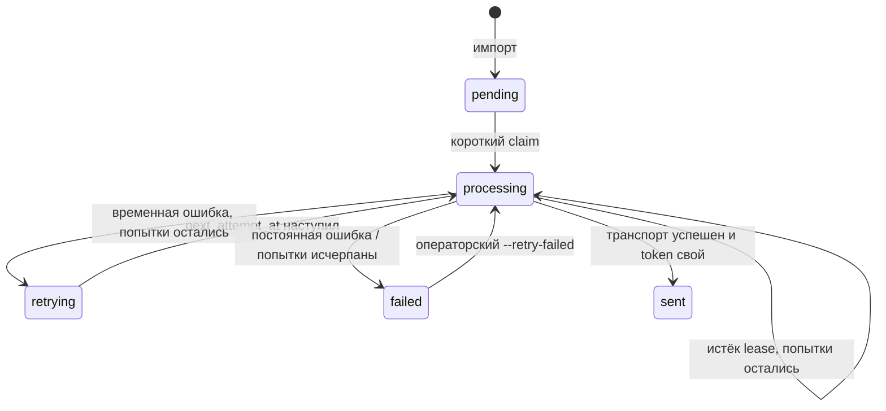

# Тестовая задача 2: импорт рассылок

Python 3.10+, Django 5.2 LTS, PostgreSQL, openpyxl. Импорт читает XLSX и создаёт
задания в БД, а отдельная management command имитирует их отправку записью в лог
с обязательной задержкой 5–20 секунд. Стандартная Django admin показывает очередь
авторизованному персоналу в режиме только для чтения.

Подробное объяснение таблицы, слоёв, SQL, транзакций, гонок и вопросов на защите:
[DEFENSE_GUIDE.md](DEFENSE_GUIDE.md). Результат полного ревью и план развития:
[REVIEW.md](REVIEW.md).

## Быстрый запуск

Все команды выполняются из каталога `task2`.

1. Запустить PostgreSQL:

   ```sh
   docker compose up -d --wait
   ```

2. Создать окружение и установить зависимости.

   Linux/macOS:

   ```sh
   python3 -m venv .venv
   . .venv/bin/activate
   python -m pip install -r requirements.txt
   ```

   Windows PowerShell:

   ```powershell
   py -3 -m venv .venv
   ./.venv/Scripts/python.exe -m pip install -r requirements.txt
   ```

3. Создать таблицу, импортировать пример и обработать очередь:

   ```sh
   python manage.py migrate
   python manage.py import_mailings examples/mailings.xlsx
   python manage.py send_mailings
   ```

   В PowerShell замените `python` на `./.venv/Scripts/python.exe`.

4. Создать администратора и открыть интерфейс:

   ```sh
   python manage.py createsuperuser
   python manage.py runserver
   ```

   Админка доступна на `http://127.0.0.1:8000/admin/`.

   В production перед запуском web-сервера нужно собрать штатные CSS/JS админки и
   отдать каталог `STATIC_ROOT` через reverse proxy или static storage:

   ```sh
   python manage.py collectstatic --noinput
   ```

Пример содержит два вымышленных адреса. Первый импорт выводит:

```text
Обработано: 2; создано: 2; пропущено: 0; ошибочных строк: 0
```

Повторный импорт создаёт 0 записей и пропускает 2. Отправка двух строк занимает
суммарно 10–40 секунд. База хранится в Docker volume `postgres_data`; обычный
`docker compose down` останавливает контейнер, сохраняя данные.

Локальные значения из `compose.yaml` и `.env.example` предназначены только для
разработки. Их можно переопределить переменными:

| Переменная | Значение по умолчанию | Назначение |
|---|---|---|
| `POSTGRES_DB` | `mailings` | Имя базы |
| `POSTGRES_USER` | `mailings` | Роль PostgreSQL |
| `POSTGRES_PASSWORD` | `mailings-local` | Локальный пароль; в общей среде обязателен секрет из окружения |
| `POSTGRES_HOST` | `127.0.0.1` | Хост базы |
| `POSTGRES_PORT` | `5432` | Порт базы и опубликованный порт Compose |
| `DJANGO_DEBUG` | `1` | Локальный режим; в production установить `0` |
| `DJANGO_SECRET_KEY` | локальный fallback только при `DEBUG=1` | При `DEBUG=0` обязателен секрет из окружения |
| `DJANGO_ALLOWED_HOSTS` | `localhost,127.0.0.1` | Разрешённые HTTP Host для админки |
| `DJANGO_HSTS_SECONDS` | `0` | После проверки HTTPS повышается постепенно; строгая production-проверка использует `31536000` |
| `DJANGO_HSTS_INCLUDE_SUBDOMAINS` | `0` | Включать после подтверждения HTTPS на всех поддоменах |
| `DJANGO_HSTS_PRELOAD` | `0` | Включать только после подготовки домена к preload |
| `MAILINGS_LEASE_SECONDS` | `300` | Через сколько секунд незавершённую попытку может забрать другой worker |
| `MAILINGS_MAX_ATTEMPTS` | `5` | Число автоматических попыток до окончательного `failed` |
| `MAILINGS_RETRY_BASE_SECONDS` | `30` | Базовая задержка автоматического повтора |
| `MAILINGS_RETRY_MAX_SECONDS` | `3600` | Верхняя граница backoff вместе с jitter |

Контейнер публикует порт только на loopback. В CI поднимается отдельный PostgreSQL
18.6. Локальная интеграционная проверка выполнена на PostgreSQL 16.14, который
поддерживается Django 5.2.

## Формат XLSX

Обрабатывается первый объявленный worksheet. Первая строка — заголовки. Порядок
произвольный, пробелы по краям имени убираются, регистр значим. Лишние колонки
игнорируются. Отсутствующий или повторяющийся обязательный заголовок делает весь
файл ошибочным.

| Колонка | Правила |
|---|---|
| `external_id` | Непустой текст до 255 символов; целая числовая ячейка допустима до 15 цифр. Пробелы по краям убираются |
| `user_id` | Положительное целое 1..9223372036854775807. Это внешний ID, а не FK на Django User |
| `email` | Валидный адрес до 254 символов; пробелы по краям убираются |
| `subject` | Непустой текст до 255 символов без переводов строк |
| `message` | Непустой текст до 32767 символов; переводы строк сохраняются |

Формулы и Excel errors в обязательных колонках отклоняются. Булевы значения, даты
и дробные ID не принимаются. Идентификаторы длиннее 15 цифр и значения с ведущими
нулями следует хранить как текст: Excel способен потерять точность числа до импорта.

Полностью пустые строки не входят в статистику. Ошибочная непустая строка увеличивает
`errors` и не занимает `external_id`. Среди валидных повторов сохраняется первое
содержимое; уже существующая запись и её статус не меняются. Для нового письма нужен
новый `external_id`.

Перед openpyxl импортёр проверяет структуру OOXML-пакета: находит workbook через
`[Content_Types].xml`, relationship первого worksheet и наличие целевой XML-части.
Имя `sheet1.xml` не предполагается. Служебный XML разбирается `defusedxml` с запретом
DTD/entities; каждая из трёх частей, читаемых целиком, ограничена 10 MiB. До openpyxl
проверяются также размер файла до 128 MiB, максимум 2048 ZIP-частей, отсутствие
зашифрованных и повторяющихся частей и суммарный объявленный распакованный размер до
512 MiB. Ячейки листа openpyxl читает потоково в `read_only=True`, не более 100 колонок.

## Команды

```sh
python manage.py import_mailings /path/to/file.xlsx --batch-size 500
python manage.py send_mailings --limit 100
python manage.py send_mailings --retry-failed
```

`--batch-size` принимает 1..500. `--limit` ограничивает число захватов за один запуск.
Временная ошибка автоматически планирует следующую попытку с exponential backoff и
небольшим jitter. Обычный запуск берёт `retrying`, только когда наступил `next_attempt_at`.
После пяти попыток запись становится `failed`. `--retry-failed` — явное операторское
переоткрытие окончательных ошибок; он не меняет остальные `failed` заранее. Одна запись
рассматривается не более одного раза за запуск, поэтому ошибка транспорта не создаёт
бесконечный цикл.

Обе команды возвращают ненулевой код при ошибках. Сводка идёт в stdout, диагностика
и транспортные события — в stderr через logging. Email, тема и тело не пишутся в лог.
При ожидаемой ошибке БД низкоуровневый текст не раскрывается даже с `--traceback`.

## Как работает пакетный импорт

1. Валидные модели накапливаются до размера пакета.
2. Повторы `external_id` внутри пакета сворачиваются: побеждает первая строка.
3. Один параметризованный PostgreSQL-запрос вставляет весь пакет:

   ```sql
   INSERT INTO mailings_mailing (...)
   VALUES (...), (...)
   ON CONFLICT (external_id) DO NOTHING
   RETURNING 1;
   ```

4. Число строк из `RETURNING` равно точному `created`; оставшиеся прочитанные строки
   считаются `skipped`.

Имена таблицы и колонок собираются через `psycopg.sql.Identifier`, значения передаются
отдельными параметрами. Пользовательские строки не конкатенируются в SQL. UNIQUE на
`external_id` остаётся окончательной защитой от дублей.

Один statement атомарен: PostgreSQL либо применяет его, либо откатывает. `ON CONFLICT`
разрешает гонку двух импортёров в самой БД, а `RETURNING` даёт каждому процессу фактический
результат его вставки. Поэтому предварительный `SELECT`, блокировка всей таблицы и ручной
retry не нужны. Реальный тест с двумя соединениями подтверждает результат: один получает
`created=1`, другой — `skipped=1`, а в таблице остаётся одна запись.

Если книга повреждается после успешных пакетов, уже зафиксированные строки остаются.
Накопленный неполный пакет сохраняется перед отчётом об известной ошибке чтения. Повторный
импорт безопасен благодаря UNIQUE. При потере ответа во время DB commit команда показывает
`unfinished`; перед повторным внешним действием состояние следует перечитать.

## Таблица и очередь отправки

`Mailing` совмещает данные письма и состояние задания:

| Поле | Смысл |
|---|---|
| `id` | Внутренний PK и порядок обхода |
| `external_id` | Глобальный ключ идемпотентности, UNIQUE |
| `user_id`, `email`, `subject`, `message` | Данные входной строки |
| `status` | `pending`, `retrying`, `processing`, `sent` или `failed` |
| `claimed_at`, `claim_token` | Время и UUID владельца попытки |
| `next_attempt_at` | Когда разрешена следующая автоматическая попытка |
| `attempts`, `last_error` | Число захватов и только имя типа последней ошибки |
| `created_at`, `sent_at` | Время создания и подтверждённой отправки |

Отправитель в короткой транзакции выбирает одну допустимую строку через
`SELECT ... FOR UPDATE SKIP LOCKED`. Строка становится `processing`, получает случайный
token, очищает расписание повтора и увеличивает `attempts`. Параллельный worker не ждёт
заблокированную строку, а берёт следующую. Транзакция завершается до задержки и транспорта.
Финальный `UPDATE` фильтруется по PK, `processing` и тому же token, поэтому старый владелец
не может завершить попытку нового владельца.

Для выборок очереди есть два составных индекса: `(status, next_attempt_at, id)` для готовых
заданий и `(status, claimed_at, id)` для восстановления истёкших lease. Их порядок совпадает
с фильтрами и обходом по PK; практическую эффективность всё равно следует проверять через
`EXPLAIN (ANALYZE, BUFFERS)` на данных продуктового размера.

Состояния переходят так:



Отправка имеет семантику at-least-once. Если процесс выполнил внешнее действие, но умер
до записи `sent`, следующий владелец после истечения lease может повторить действие.
Каждая попытка получает стабильный SHA-256 idempotency key от `external_id`; учебный
транспорт пишет его в лог, не раскрывая внешний ID. Адаптер настоящего провайдера должен
передать этот ключ в API и, если API возвращает идентификатор сообщения, сохранить его.
Без поддержки идемпотентности на стороне провайдера строгое exactly-once недостижимо.

## Админка

`Mailing` зарегистрирована с русскими названиями приложения, модели, полей и статусов.
Список показывает ID, внешний ключ, пользователя, адрес, статус, число попыток и даты.
Доступны фильтры по статусу и датам и поиск по `external_id`, `user_id`, email и теме.

Админка намеренно только для просмотра: добавление, изменение, удаление и actions запрещены
даже суперпользователю. Иначе ручная правка могла бы нарушить идемпотентность и протокол
`status/claim_token/lease`. Импорт и переходы состояния выполняются только командами и
service-функциями. Доступ защищают стандартные Django auth, sessions, CSRF, messages,
SecurityMiddleware и clickjacking middleware. Для создаваемых администраторов включены
штатные проверки сходства пароля с данными пользователя, минимальной длины, распространённых
и полностью цифровых паролей.

Для production `DEBUG=0` требует непустые `DJANGO_SECRET_KEY` и `POSTGRES_PASSWORD`;
автоматически включаются HTTPS redirect и secure cookies. Длительность HSTS, его распространение
на поддомены и preload задаются явно: их нельзя безопасно включать до проверки всех доменов
и поддоменов. CI проверяет строгий вариант с HSTS на один год.

## Архитектура

Management commands — тонкий delivery-слой: аргументы, вызов сценария, печать результата.
Админка — отдельный read-only operational delivery-слой.
`importing.py` и `sending.py` — application services. `models.py` хранит состояние и DB-инвариант.
Django ORM/psycopg, openpyxl, ZIP/XML и logging — инфраструктура. Такая слоистость следует
практическим советам Two Scoops of Django без каталогов и интерфейсов с единственной
реализацией. Repository, selector, Celery и HTTP API здесь не решают требования задачи.

## Проверки

```sh
python -m pip install -r requirements-dev.txt
python manage.py check
python manage.py makemigrations --check --dry-run
python manage.py test mailings
python -m ruff check .
python -m ruff format --check .
```

Перед командами должна быть доступна тестовая PostgreSQL с правом создавать временную БД.
Django создаёт `test_<POSTGRES_DB>` и удаляет её после suite.

Фактический результат 16.09.2026 после текущих изменений:

- PostgreSQL 16.14, Python 3.12: 52/52, OK;
- PostgreSQL 16.14, Python 3.10: 52/52, OK;
- конкурентный импорт с двумя соединениями: OK;
- параллельный захват очереди двумя worker: OK;
- локализация, поиск и read-only permissions админки: OK;
- SQL CHECK для `user_id` и согласованности полей состояния: OK;
- `manage.py check`: без замечаний;
- `manage.py check --deploy` с production-переменными: без замечаний;
- `makemigrations --check --dry-run`: `No changes detected`;
- Ruff lint/format: без замечаний.

CI повторяет `pip check`, production deployment check, Django checks, 52 теста и Ruff
на Python 3.10/3.12 с
PostgreSQL 18.6. Workflow имеет read-only permissions, десятиминутный timeout и полные
SHA официальных actions; он запускается при каждом push и pull request.

Runtime-зависимости зафиксированы в `requirements.txt`, диапазоны прямых зависимостей —
в `requirements.in`. `psycopg[binary]` упрощает одинаковую установку на поддерживаемых ОС;
для окружения со своей политикой системных библиотек можно перейти на обычный `psycopg[c]`.
`typing-extensions` нужен на Python ниже 3.13 из-за совокупных требований asgiref и psycopg.

## Честные ограничения

- Нет scheduler: очередь обрабатывается только явным запуском команды.
- Есть retry policy, backoff+jitter, предел попыток и стабильный provider idempotency key;
  нет lease heartbeat и конкретного API почтового провайдера.
- Lease пять минут подходит учебному транспорту до 20 секунд, но не произвольной интеграции.
- `external_id` глобален; несколько источников потребуют составной области уникальности.
- База проверяет `user_id > 0` и согласованность status/token/timestamps;
  последовательность переходов и право владельца по-прежнему обеспечивает service.
- Лимиты XLSX основаны на размере файла и объявленных ZIP metadata; это снижает риск
  истощения ресурсов, но не заменяет внешний upload limit, timeout и контроль памяти процесса.
- БД содержит персональные данные; продукту нужны права, шифрование/backup и retention policy.
- В проекте есть стандартная read-only admin, но нет бизнес-API. Перед API нужны tenant
  scoping, объектная авторизация, consent rules, rate limits и upload limits.

Эти улучшения следует добавлять по требованиям или измерениям. Текущая задача не требует
брокера, универсального workflow engine или дополнительных абстракций.

## Основные источники

- [Django 5.2: PostgreSQL notes](https://docs.djangoproject.com/en/5.2/ref/databases/#postgresql-notes)
- [PostgreSQL: INSERT, ON CONFLICT и RETURNING](https://www.postgresql.org/docs/current/sql-insert.html)
- [openpyxl: optimized read-only mode](https://openpyxl.readthedocs.io/en/stable/optimized.html)
- [Django: custom management commands](https://docs.djangoproject.com/en/5.2/howto/custom-management-commands/)
- [Django: ModelAdmin](https://docs.djangoproject.com/en/5.2/ref/contrib/admin/)
- [Two Scoops of Django 3.x](https://github.com/feldroy/two-scoops-of-django-3.x)
- [Django Styleguide](https://github.com/HackSoftware/Django-Styleguide)
