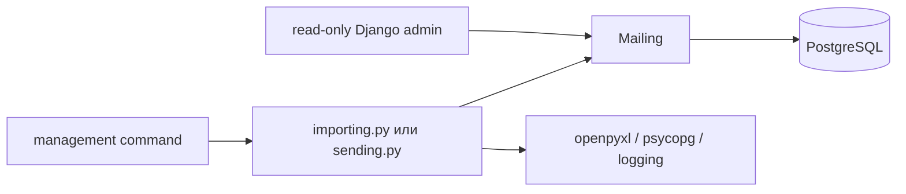

# Полное ревью решения

Дата проверки: 16.09.2026. Область: весь проект `task2`, включая импорт XLSX,
модель, PostgreSQL, очередь отправки, read-only admin, команды, тесты, зависимости,
CI и документацию.

## Итог

Решение выполняет требования задачи и остаётся компактным: одна модель, две management
commands и два service-модуля. После перехода на PostgreSQL пакетная дедупликация выполняется
одним атомарным `INSERT ... ON CONFLICT DO NOTHING RETURNING`; счётчики не строятся на
предварительном SELECT и корректны при конкурирующих импортёрах.
Админка локализована, защищена стандартным Django auth stack и не разрешает CRUD в обход
очереди. Ключевые инварианты состояния дополнительно закреплены CHECK constraints.

Блокирующих замечаний по корректности и безопасности после исправлений нет. Открытые
ограничения относятся к продуктовым требованиям: настоящий почтовый провайдер и его
timeout/error contract, scheduler, права на персональные данные, lease heartbeat для
долгих вызовов и внешний контроль ресурсов процесса.

## Соответствие заданию

| Требование | Статус | Реализация |
|---|---|---|
| Python 3.10+ | Выполнено | Полный suite пройден на 3.10 и 3.12 |
| Django 4.2+ | Выполнено | Django 5.2.17 LTS |
| Django-проект | Выполнено | `config`, приложение `mailings`, миграция |
| Административный интерфейс | Выполнено дополнительно | Русская read-only Django admin с фильтрами и поиском |
| SQLite или PostgreSQL | Выполнено | PostgreSQL; Compose и CI service |
| Импорт XLSX командой | Выполнено | `import_mailings` |
| Первая строка — заголовки | Выполнено | Пять обязательных колонок, произвольный порядок |
| Большие файлы | Выполнено в заданном масштабе | `read_only=True`, пакет 1..500, лимиты файла/ZIP/колонок; библиотечные метаданные всё ещё могут занимать память |
| Защита от повторной обработки | Выполнено | UNIQUE + `ON CONFLICT`; первое валидное содержимое сохраняется |
| Последующая отправка | Выполнено | `send_mailings`; лог вместо SMTP/API |
| Обязательная задержка | Выполнено | `sleep(randint(5, 20))` |
| Итоговые счётчики | Выполнено | processed/created/skipped/errors; для DB-сбоя также unfinished |
| Повторы и конкурентные workers | Выполнено | `SKIP LOCKED`, lease, token, max attempts, backoff+jitter, стабильный idempotency key |
| Prod-like качество | Выполнено в границах задачи | Валидация, конкурентность, auth/CSRF, DB constraints, документация, тесты, CI |
| Публичный GitHub/main | Настраивается на стороне GitHub | Код и workflow предназначены для ветки `main`; visibility должна быть Public |

## Архитектура

Поток вызовов:



Границы выбраны удачно:

- команда знает только аргументы, service-вызов и вывод отчёта;
- админка даёт авторизованное наблюдение и не меняет очередь;
- импорт и отправка не помещены в `models.save()`, signals или command handler;
- модель хранит данные и состояние, а UNIQUE обеспечивает окончательный инвариант;
- DB-транзакция не охватывает чтение XLSX, случайную задержку или внешний side effect;
- transport interface, repository, selector, Celery и HTTP API не добавлены без второго
  варианта реализации или эксплуатационной необходимости.

Это практическая слоистая архитектура в духе Two Scoops of Django: ответственность
разделена модулями, но структура не раздроблена ради названий слоёв.

## Импорт XLSX

### Trust boundary

XLSX считается недоверенным входом. До чтения ячеек код:

1. открывает файл как ZIP;
2. находит workbook part по `[Content_Types].xml`;
3. читает workbook relationships;
4. находит первый relationship типа worksheet;
5. разрешает относительный или абсолютный target;
6. убеждается, что XML-part существует.

Служебный XML разбирается `defusedxml` с запретом DTD/entities. Каждая служебная часть,
которую код читает целиком, ограничена 10 MiB. До разбора проверяются общий размер файла
до 128 MiB, максимум 2048 ZIP-частей, отсутствие encrypted/duplicate entries и сумма
объявленных распакованных размеров до 512 MiB. openpyxl получает не более 100 колонок.
Это закрывает подмену первого отсутствующего листа следующим и типовые XML/ZIP resource
attacks, но внешний upload limit и лимит памяти процесса всё равно нужны на web-границе.

### Валидация строки

Валидация выполняется до БД. Код различает Python `bool` и `int`, запрещает формулы/errors,
проверяет диапазон `user_id`, точность длинных Excel-чисел, длины строк, email, нулевой байт
и переводы строк в полях заголовка письма. Полные значения строки не попадают в диагностику.

Политика понятна: невалидная строка увеличивает `errors`, но не резервирует `external_id`.
Среди валидных повторов сохраняется первая строка. Повторный импорт не обновляет payload или
статус существующей записи.

### PostgreSQL и конкурентность

`save_batch()` сначала сворачивает повторы внутри пакета, затем выполняет один запрос:

```sql
INSERT INTO mailings_mailing (...)
VALUES (...), (...)
ON CONFLICT (external_id) DO NOTHING
RETURNING 1;
```

Почему это лучше прежнего SELECT + INSERT:

- UNIQUE решает конфликт там, где он реально возникает;
- один statement атомарен;
- `RETURNING` сообщает число фактически вставленных строк конкретному импортёру;
- конкурирующий победитель не вызывает `IntegrityError` и не искажает `created/skipped`;
- нет table lock, serializable isolation и retry-loop.

Запрос строится через `psycopg.sql.Identifier`; значения остаются bound parameters. Raw SQL
оправдан узкой возможностью PostgreSQL, которой Django `bulk_create(ignore_conflicts=True)`
не возвращает точное количество вставленных объектов.

Размер пакета ограничен 500: максимум 6500 параметров на statement. В памяти находится
текущий пакет, хотя openpyxl вправе дополнительно хранить shared strings и метаданные.

## Модель и схема

`external_id` имеет UNIQUE. Для очереди есть индексы `(status, next_attempt_at, id)` и
`(status, claimed_at, id)`. `user_id` — внешний положительный bigint, а не связь с локальным
пользователем. `claim_token` отделяет конкретную попытку конкретного владельца;
`claimed_at` образует lease; `next_attempt_at` планирует повторы; `attempts` и `last_error`
дают минимальную операционную диагностику без текста исключения.

Миграции `0002` и `0003` закрепляют `user_id > 0`, новые индексы и допустимые комбинации
`status`, `claim_token`, `claimed_at`, `next_attempt_at`, `sent_at`. База отклоняет,
например, `sent` без `sent_at`, `processing` без token/lease и `retrying` без расписания.
CHECK не заменяет service: финальный условный UPDATE с собственным token определяет право
перехода, а БД проверяет форму конечного состояния.

## Админка

Стандартная Django admin подключена через auth, contenttypes, sessions, messages и staticfiles.
Русские `verbose_name`, подписи choices и `MailingsConfig.verbose_name` дают понятный интерфейс.
Changelist имеет безопасный набор колонок, фильтры по статусу/датам, поиск по внешнему ID,
пользователю, email и теме, date hierarchy и ограничение 100 строк на страницу.

Включены четыре штатных Django password validator. В production статика собирается
`collectstatic` и отдаётся web-сервером или static storage; встроенный `runserver` остаётся
локальным способом запуска.

`has_add_permission`, `has_change_permission` и `has_delete_permission` возвращают False;
actions отключены, поля change view readonly. Это операционный экран, а не второй путь записи.
Персональные данные видны авторизованному администратору, поэтому в реальном продукте нужны
минимальные staff permissions, аудит доступа и HTTPS.

## Отправитель

Захват использует штатную конкурентную очередь PostgreSQL:

1. выбирается кандидат до `max_id`, зафиксированного в начале запуска;
2. короткая транзакция блокирует одну строку через `select_for_update(skip_locked=True)`;
3. строка получает `processing`, UUID token и увеличенный attempts, затем транзакция завершается;
4. после транспорта финальный UPDATE фильтруется по PK, `processing` и тому же token.

Два процесса не получают одну строку: второй пропускает её и может взять следующую. Старый
владелец после истечения lease не способен записать результат поверх нового владельца.
Задержка и транспорт выполняются без открытой транзакции и без удержания row lock. Это
проверено тестом с двумя реальными соединениями PostgreSQL.

`after_id` гарантирует, что один запуск не зациклится на повторно упавшей записи. `max_id`
не является транзакционным snapshot: новые строки намеренно остаются следующему запуску.

Временная ошибка создаёт `retrying` с exponential backoff, jitter и максимумом задержки;
постоянная `PermanentTransportError` или исчерпание пяти попыток создаёт terminal `failed`.
`--retry-failed` оставлен как явное операторское переоткрытие. Истёкший lease восстанавливается,
а истёкшая последняя попытка завершается без нового транспорта.

Транспортная запись использует строгий StreamHandler, потому что в задании именно лог
является результатом отправки. Ошибка `write()` считается временной ошибкой и планирует
повтор. Диагностические логи остаются best effort и не заменяют уже сохранённый
бизнес-результат собственной ошибкой.

Гарантия доставки — at-least-once. Между успешным внешним действием и записью `sent` есть
crash window. Exactly-once нельзя получить обычной транзакцией между PostgreSQL и сторонним
почтовым API. Код формирует стабильный SHA-256 idempotency key из глобально уникального
`external_id` и передаёт его транспорту; реальный адаптер должен передать его провайдеру.
Если провайдер не поддерживает идемпотентность, transactional outbox сам по себе не устранит
повтор внешнего эффекта.

## Ошибки и наблюдаемость

Известные ошибки входного файла и БД преобразуются в типизированные service exceptions.
Команды печатают безопасную статистику и завершаются ненулевым кодом. Низкоуровневый
DB payload не выводится пользователю. Причина сохраняется в `__cause__` для тестов и
программной диагностики внутри процесса.

При ошибке импорта:

```text
unfinished = processed - created - skipped - errors
```

При сбое после транспорта отправитель показывает `unconfirmed=1` и останавливается без
автоматического повтора. Это честно отражает неизвестный результат финального UPDATE.

## Безопасность

Проверено следующее:

- XML runtime разбирается защищённым parser;
- файл и строки валидируются на границе;
- SQL values параметризованы, identifiers экранирует psycopg;
- логи не содержат email, subject, message и DB error payload;
- локальный PostgreSQL публикуется Compose только на `127.0.0.1`;
- локальные secret/password явно ограничены DEBUG/local Compose; при `DEBUG=0` приложение
  требует непустые `DJANGO_SECRET_KEY` и `POSTGRES_PASSWORD` из окружения;
- стандартные password validators применяются при создании/изменении admin-пользователей;
- admin защищена auth/session/CSRF, secure cookies, clickjacking и SecurityMiddleware;
- при `DEBUG=0` включаются HTTPS redirect и secure cookies; HSTS duration,
  subdomains и preload требуют явного решения после проверки HTTPS;
- CI token имеет `contents: read`, checkout не сохраняет credentials;
- полные SHA actions уменьшают риск подмены workflow dependency;
- Ruff включает security rules; Bandit и pip-audit входят в локальный аудит.

Для бизнес-API дополнительно нужны object/tenant scoping, consent rules, rate limits и
политика загрузки файлов. Настройки reverse proxy (`SECURE_PROXY_SSL_HEADER`, trusted origins)
должны соответствовать конкретной инфраструктуре, их нельзя угадать в тестовом проекте.

## Тесты

52 тестовых метода проверяют:

- happy path, повторы в одном/разных пакетах и повторный импорт;
- порядок и дубли заголовков, пустые строки, типы и границы полей;
- формулы, shared strings, missing/renamed worksheet, XML entities и oversized metadata;
- частичное сохранение при повреждении и безопасный отчёт при DB-сбое;
- UNIQUE schema constraint;
- успех, scheduled/permanent failure, backoff, max attempts, limit, lease, lost claim и DB failures;
- ошибки и закрытие строгого transport log stream;
- реальную гонку двух PostgreSQL-соединений за один `external_id` с точными счётчиками;
- параллельный захват двух разных писем двумя workers через `SKIP LOCKED`;
- русские имена/choices, admin changelist/search и запрет admin CRUD;
- CHECK constraints для `user_id` и согласованности состояния.

Фактические результаты:

| Проверка | Результат |
|---|---|
| PostgreSQL 16.14 + Python 3.12 | 52 теста, OK, 1.677 с |
| PostgreSQL 16.14 + Python 3.10 | 52 теста, OK, 2.099 с |
| Два concurrency tests с реальными соединениями | OK |
| `manage.py check` | 0 замечаний |
| `makemigrations --check --dry-run` | No changes detected |
| `manage.py check --deploy` с production env | 0 замечаний |
| Ruff lint | All checks passed |
| Ruff format | 19 файлов отформатированы |

Время — единичное наблюдение, а не benchmark. Локально тестировался PostgreSQL 16.14;
workflow запускает проверки с PostgreSQL 18.6 при push и pull request.

## Исправленные проблемы

| Приоритет | Проблема | Исправление |
|---|---|---|
| P1 | Гонка SELECT существующих ID → INSERT и неточные counters | PostgreSQL `ON CONFLICT DO NOTHING RETURNING`; реальный двухпоточный тест |
| P1 | Повреждённый первый worksheet мог быть молча заменён вторым | Проверка OOXML relationship и наличия part до openpyxl |
| P2 | `TranslatorError`/`OverflowError` обходили частичный отчёт | Узкие обработчики чтения и сохранение накопленного пакета |
| P2 | Ошибка transport log могла дать ложный `sent` | Строгий handler только для transport event |
| P2 | DB error раскрывал низкоуровневый payload или терял статистику | Типизированные ошибки, безопасные CommandError и partial counters |
| P2 | Старый владелец мог завершить новую попытку | UUID claim token в финальном conditional UPDATE |
| P3 | Lock был неполным для Python 3.10 | Compile для минимальной версии с сохранёнными markers |
| P3 | Небезопасный XML parser и неограниченная metadata | `defusedxml` и лимит 10 MiB |
| P2 | Временный сбой требовал ручного повтора | `retrying`, max attempts, backoff+jitter и terminal failures |
| P2 | Workers конкурировали за кандидата | Короткий `SELECT FOR UPDATE SKIP LOCKED`; реальный двухпоточный тест |
| P2 | Повтор у настоящего провайдера не имел стабильного ключа | SHA-256 key от глобального `external_id` передаётся transport boundary |
| P2 | XLSX ограничивал только три XML-файла | Лимит файла, количества ZIP entries, распакованного размера и колонок |

## Что улучшать дальше

1. После первого зелёного GitHub Actions run защитить `main` обязательной проверкой.
2. Для реальной почты определить timeout/error contract провайдера, передавать готовый
   idempotency key, хранить provider ID и различать подтверждённый отказ с неизвестным исходом.
3. Если транспорт может длиться близко к lease, добавить heartbeat/renewal по своему token.
4. Запускать `send_mailings` через принятый scheduler/supervisor и мониторить terminal failed,
   oldest ready job, expired leases и долю повторов.
5. Перед API определить tenant/source scope, согласие на рассылку, права, retention и backup.
6. Перед применением `0003` к существующей production-базе проверить старые строки на новые
   constraints и оценить время создания индексов; для большой таблицы нужен отдельный
   rolling-deploy план с concurrent indexes.
7. Измерить RSS и время на реалистичных XLSX; при web-upload добавить более низкий лимит тела,
   timeout и изоляцию процесса.
8. Проверить планы запросов очереди через `EXPLAIN (ANALYZE, BUFFERS)` на продуктовых данных.

Celery, REST API, repository layer, универсальный transport interface и отдельные selectors
не нужны до появления соответствующего требования. Они увеличат код и эксплуатацию, но не
закроют текущие риски.
